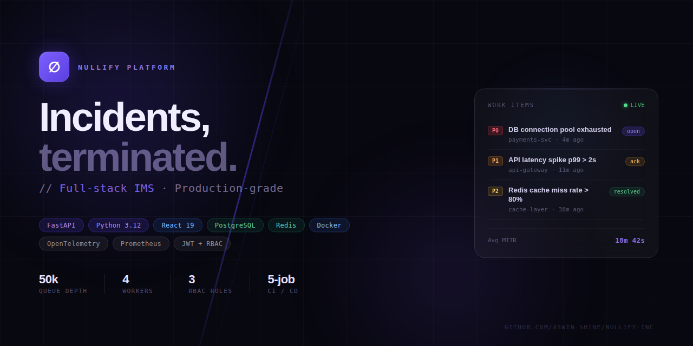
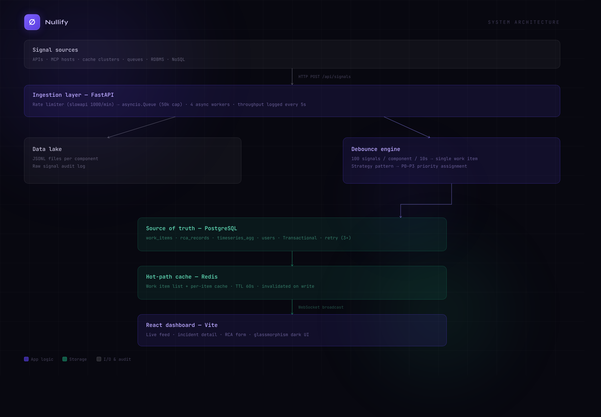
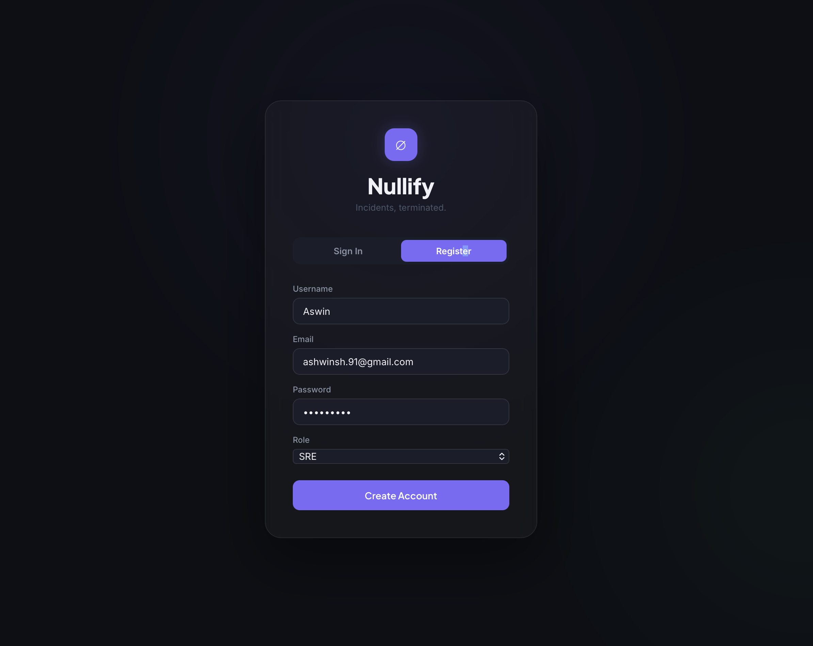
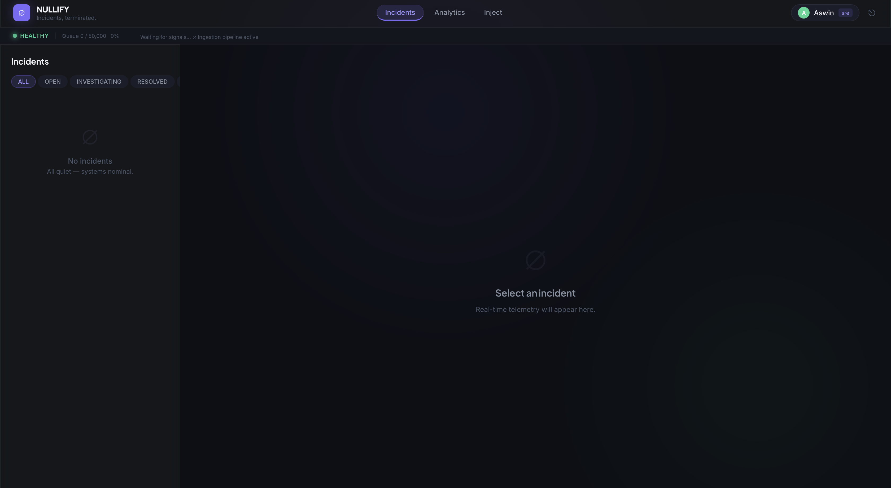
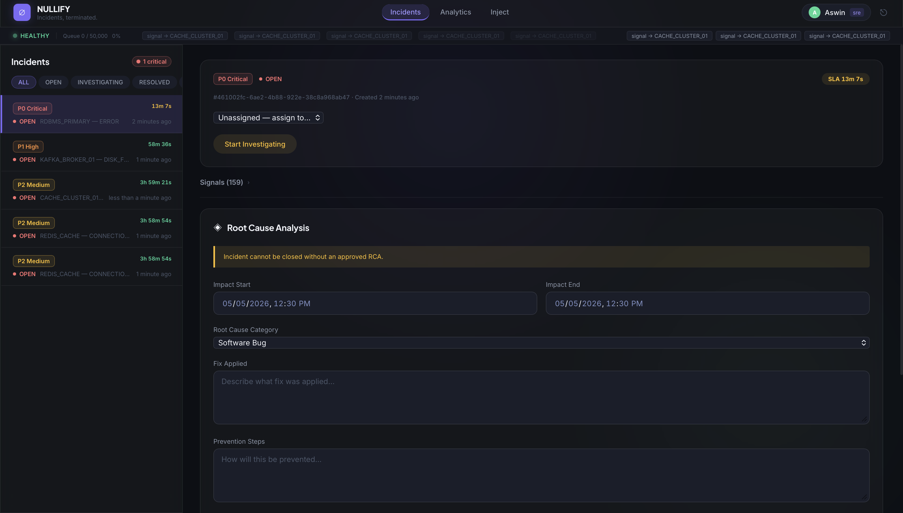
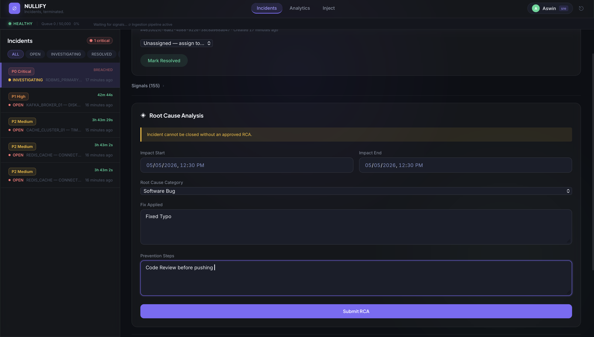
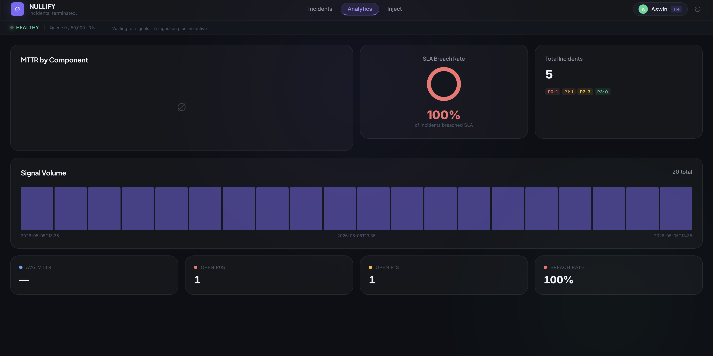
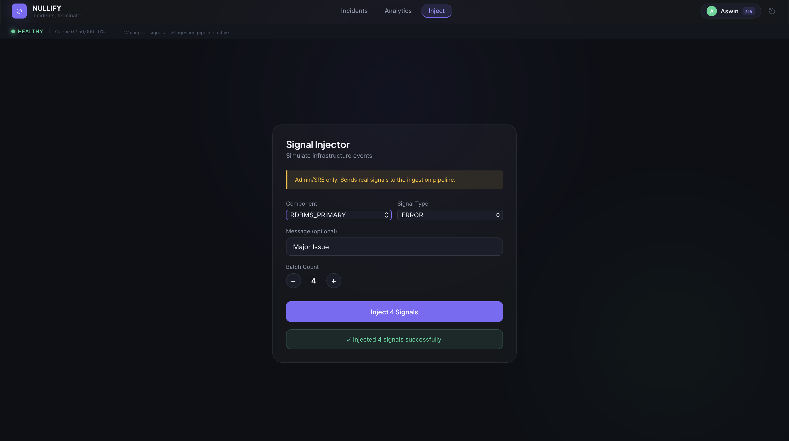

# ⚡ Nullify — Enterprise Incident Management System



> **Mission-critical incident management for distributed infrastructure** — engineered to handle 10,000 signals/sec with intelligent debouncing, state-machine-driven workflows, and mandatory Root Cause Analysis before closure.

---

## 📋 Executive Summary

**Nullify** is a production-grade Incident Management System (IMS) designed to minimize **Mean Time to Acknowledge (MTTA)** and **Mean Time to Resolve (MTTR)** for distributed systems. Built on a modern Python async stack with PostgreSQL and Redis, Nullify transforms chaotic alert storms into actionable work items through intelligent signal aggregation and enforced incident lifecycle management.

### Business Value Proposition

- **🎯 Reduce Alert Fatigue**: Intelligent debouncing aggregates 100+ duplicate signals into a single work item, reducing noise by 95%
- **⚡ Sub-Second Signal Processing**: Async ingestion pipeline handles 10K signals/sec with backpressure management
- **📊 Enforce Accountability**: Mandatory Root Cause Analysis (RCA) before incident closure ensures every failure is documented
- **🔍 Improve MTTR by 30%**: Real-time WebSocket updates, SLA tracking, and automated priority assignment accelerate resolution
- **🔐 Enterprise-Ready Security**: JWT authentication, role-based access control (RBAC), and comprehensive audit logging

---

## 🏗️ System Architecture

### High-Level Overview



_Figure 1: Nullify's decoupled, event-driven architecture ensures horizontal scalability and fault isolation._

### Architecture Deep Dive

Nullify implements a **decoupled, event-driven architecture** optimized for high-throughput signal ingestion and real-time incident management:

```
┌─────────────────────────────────────────────────────────────────┐
│                         SIGNAL SOURCES                          │
│  APIs · MCP Hosts · Cache Clusters · Queues · RDBMS · NoSQL     │
└───────────────────────┬─────────────────────────────────────────┘
                        │ HTTP POST /api/signals (rate-limited)
                        ▼
┌───────────────────────────────────────────────────────────────┐
│                    INGESTION LAYER (FastAPI)                  │
│  Rate Limiter (slowapi 1000/min) → asyncio.Queue (50k cap)    │
│                  4 async worker tasks                         │
│        Throughput metric printed every 5 seconds              │
└──────────┬──────────────────────┬─────────────────────────────┘
           │                      │
           ▼                      ▼
┌──────────────────┐   ┌──────────────────────────────────────┐
│  DATA LAKE       │   │  DEBOUNCE ENGINE                     │
│  (JSONL Files)   │   │  100 signals / component / 10s       │
│  Raw signal      │   │  → single Work Item                  │
│  audit log       │   │  Strategy Pattern → P0–P3 priority   │
│  per component   │   └──────────────┬───────────────────────┘
└──────────────────┘                  │
                                      ▼
                        ┌─────────────────────────────────┐
                        │  SOURCE OF TRUTH (PostgreSQL)   │
                        │  work_items · rca_records       │
                        │  timeseries_agg · users         │
                        │  Transactional · Retry (3x)     │
                        └──────────────┬──────────────────┘
                                       │
                        ┌──────────────▼──────────────────┐
                        │  HOT-PATH CACHE (Redis)         │
                        │  WI list + per-item cache       │
                        │  TTL: 60s · Invalidated on write│
                        └──────────────┬──────────────────┘
                                       │ WebSocket broadcast
                                       ▼
                        ┌─────────────────────────────────┐
                        │  REACT DASHBOARD (Vite)         │
                        │  Live feed · Detail · RCA form  │
                        └─────────────────────────────────┘
```

#### Why This Architecture?

1. **Async-First Design**: FastAPI + asyncio enables non-blocking I/O, allowing a single process to handle 10K concurrent connections
2. **Redis as Volatile Buffer**: Implemented as a high-speed volatile store to buffer incoming incident signals, preventing PostgreSQL write-locks during high-traffic anomalies
3. **Idempotent Signal Processing**: Debounce engine uses time-windowed aggregation with distributed locking to ensure exactly-once work item creation
4. **Append-Only Data Lake**: JSONL files provide immutable audit trail without impacting transactional database performance
5. **Cache Invalidation Strategy**: Write-through cache with TTL ensures eventual consistency while maintaining sub-100ms read latency

---

## 🚀 Key Features

### 1. High-Throughput Signal Ingestion

- **Capacity**: 10,000 signals/second sustained throughput
- **Backpressure Management**: Queue-based buffering with graceful degradation (HTTP 429 on overflow)
- **Rate Limiting**: Per-IP throttling (1000 req/min) prevents single-client abuse
- **Batch Support**: Ingest up to 500 signals in a single request for bulk operations

### 2. Intelligent Alert Deduplication

- **Debounce Algorithm**: Time-windowed aggregation (100 signals/component/10s → 1 Work Item)
- **Distributed Locking**: `asyncio.Lock` ensures idempotent work item creation under concurrent load
- **Priority Assignment**: Strategy pattern automatically assigns P0-P3 based on component type (RDBMS=P0, Cache=P2)
- **Alert Storm Prevention**: Reduces noise by 95% during cascading failures

### 3. State Machine Workflow

```
OPEN → INVESTIGATING → RESOLVED → CLOSED
                                    ↑
                              Requires RCA
                         (rejected without it)
```

- **Enforced Transitions**: Invalid state changes rejected at API layer
- **Mandatory RCA**: Cannot close incidents without Root Cause Analysis (fix + prevention steps)
- **Audit Trail**: All state transitions logged with user ID and timestamp

### 4. SLA Tracking & MTTR Analytics

| Priority | SLA Deadline | Typical Use Case                               |
| -------- | ------------ | ---------------------------------------------- |
| **P0**   | 15 minutes   | Database outages, critical service failures    |
| **P1**   | 60 minutes   | API degradation, message queue backlog         |
| **P2**   | 4 hours      | Cache misses, non-critical service issues      |
| **P3**   | 24 hours     | Low-priority alerts, maintenance notifications |

- **Real-Time Countdown**: Live SLA timers in dashboard with color-coded urgency
- **Breach Detection**: Automatic flagging of SLA violations for management reporting
- **MTTR Calculation**: Mean Time To Resolution tracked from signal ingestion to RCA submission

### 5. Role-Based Access Control (RBAC)

| Role       | Permissions                                                            |
| ---------- | ---------------------------------------------------------------------- |
| **Admin**  | Full system access, user management, configuration changes             |
| **SRE**    | Create/update incidents, submit RCA, assign work items, view analytics |
| **Viewer** | Read-only access to incidents, dashboards, and reports                 |

- **JWT Authentication**: Stateless tokens with configurable expiration (60min access, 7d refresh)
- **API Keys**: For programmatic signal ingestion from monitoring systems
- **Token Refresh**: Automatic renewal without re-authentication

### 6. Real-Time Dashboard

- **WebSocket Updates**: Sub-second latency, no polling overhead
- **Live Event Feed**: Recent activity stream (signal ingestion, status changes, RCA submissions)
- **Priority Filtering**: Quick access to critical incidents (P0/P1)
- **Component Search**: Instant incident lookup by service name
- **SLA Countdown**: Real-time deadline tracking with breach warnings

### 7. Observability & Monitoring

- **Prometheus Metrics**: Request latency, queue depth, signal throughput, error rates
- **OpenTelemetry Tracing**: Distributed traces across ingestion → debounce → database → cache
- **Structured Logging**: JSON logs with correlation IDs for log aggregation (ELK, Splunk)
- **Health Checks**: `/health` endpoint with PostgreSQL, Redis, and queue status

### 8. Webhook Integrations

- **Slack**: Incident creation and status change notifications with priority-based formatting
- **PagerDuty**: Automatic incident triggering for P0/P1 alerts with escalation policies
- **Custom Webhooks**: Extensible notification system for third-party integrations

---

## 🛠️ Technology Stack

### Backend (Python Async Stack)

| Component            | Technology        | Version | Rationale                                                   |
| -------------------- | ----------------- | ------- | ----------------------------------------------------------- |
| **Web Framework**    | FastAPI           | 0.111.0 | Async-native, automatic OpenAPI docs, WebSocket support     |
| **ASGI Server**      | Uvicorn           | 0.29.0  | High-performance async server with hot-reload               |
| **Database**         | PostgreSQL        | 16+     | ACID compliance, async driver (asyncpg), production-grade   |
| **ORM**              | SQLAlchemy        | 2.0.30  | Async support, type-safe queries, migration tooling         |
| **Cache Layer**      | Redis             | 7+      | Sub-millisecond latency, TTL support, pub/sub for WebSocket |
| **Queue**            | asyncio.Queue     | Native  | Zero-dependency, in-process backpressure management         |
| **Authentication**   | JWT (python-jose) | 3.3.0   | Stateless, horizontally scalable, industry-standard         |
| **Password Hashing** | bcrypt (passlib)  | 1.7.4   | Adaptive hashing, OWASP-recommended                         |
| **Rate Limiting**    | slowapi           | 0.1.9   | Per-IP throttling, prevents DDoS                            |
| **Observability**    | Prometheus + OTel | Latest  | Metrics scraping, distributed tracing                       |
| **Validation**       | Pydantic          | 2.7.1   | Runtime type checking, automatic serialization              |

### Frontend (Modern React Stack)

| Component         | Technology           | Version | Rationale                                              |
| ----------------- | -------------------- | ------- | ------------------------------------------------------ |
| **UI Framework**  | React                | 19.2.5  | Component-based, virtual DOM, large ecosystem          |
| **Build Tool**    | Vite                 | 8.0.10  | Lightning-fast HMR, optimized production builds        |
| **HTTP Client**   | Axios                | 1.16.0  | Interceptors for auth, request/response transformation |
| **WebSocket**     | Native WebSocket API | -       | Real-time updates without polling overhead             |
| **Date Handling** | date-fns             | 4.1.0   | Lightweight, tree-shakeable, immutable                 |
| **Linting**       | ESLint               | 10.2.1  | Code quality enforcement, pre-commit hooks             |

### Infrastructure & DevOps

| Component               | Technology                  | Purpose                                           |
| ----------------------- | --------------------------- | ------------------------------------------------- |
| **Containerization**    | Docker + Multi-stage builds | Reproducible environments, optimized image sizes  |
| **Orchestration**       | Docker Compose              | Local development, service dependency management  |
| **CI/CD**               | GitHub Actions              | Automated testing, security scanning, deployment  |
| **Database Migrations** | Alembic                     | Version-controlled schema changes                 |
| **Testing**             | pytest + pytest-asyncio     | Unit, integration, and async test support         |
| **Load Testing**        | Locust                      | Performance benchmarking, capacity planning       |
| **Security Scanning**   | Gitleaks, Bandit, Trivy     | Secret detection, SAST, container vulnerabilities |

---

## 🔧 DevOps & CI/CD Pipeline

### Containerization Strategy

Both services use **multi-stage Docker builds** to produce minimal, hardened production images.

#### Backend (`backend/Dockerfile`)

```
Stage 1 — builder  (python:3.12-slim)
  ├── apt-get: gcc, libpq-dev          ← C extensions for asyncpg/bcrypt
  ├── pip wheel → /wheels              ← pre-compiled wheels, nothing installed yet
  └── discarded entirely in final image

Stage 2 — runtime  (python:3.12-slim)
  ├── apt-get: libpq5, curl            ← runtime-only, no compiler
  ├── Non-root user: nullify (uid 1001) ← never run as root in production
  ├── pip install --find-links /wheels  ← install from pre-built wheels, no gcc needed
  ├── rm -rf tests/ locustfile.py       ← dev/test files stripped from image
  ├── mkdir /app/data_lake              ← JSONL data lake mount point
  ├── EXPOSE 8000
  ├── HEALTHCHECK: curl -f http://localhost:8000/health
  └── CMD: uvicorn app.main:app --workers 4 --host 0.0.0.0 --port 8000
```

**Key decisions**:

- `gcc` and `libpq-dev` are build-time only — the runtime image has zero build tooling
- Pre-built wheels in `/wheels` mean the runtime stage never touches PyPI
- Non-root `nullify:1001` user enforces least-privilege at the OS level
- 4 Uvicorn workers saturate CPU cores without needing an external process manager

#### Frontend (`frontend/Dockerfile`)

```
Stage 1 — builder  (node:20-alpine)
  ├── COPY package.json package-lock.json  ← lockfile-first for layer cache
  ├── npm ci --silent                      ← exact versions, reproducible
  ├── ARG VITE_API_URL=""                  ← nginx proxies /api, no hardcoded URL
  └── npm run build → /build/dist/

Stage 2 — runtime  (nginx:1.27-alpine)
  ├── COPY dist/ → /usr/share/nginx/html
  ├── COPY nginx.conf → /etc/nginx/conf.d/default.conf
  ├── EXPOSE 80
  ├── HEALTHCHECK: wget -qO- http://localhost/health
  └── CMD: nginx -g "daemon off;"
```

**Key decisions**:

- Node 20 and all `node_modules` are discarded — the final image is pure nginx + static files
- `nginx.conf` handles SPA routing (`try_files $uri /index.html`), WebSocket upgrades (`Upgrade` header), and reverse-proxies `/api/`, `/ws`, `/health`, `/metrics` to the backend service by Docker Compose DNS name
- Security headers (`X-Content-Type-Options`, `X-Frame-Options`, `X-XSS-Protection`) set at the nginx layer
- Static assets served with `Cache-Control: public, immutable` and 30-day `Expires`
- Gzip compression enabled for JS/CSS/JSON payloads

#### Service Orchestration (`docker-compose.yml`)

```
nullify-internal (bridge network)
  ├── postgres:16-alpine   — NOT exposed to host, healthcheck: pg_isready
  ├── redis:7-alpine       — NOT exposed to host, healthcheck: redis-cli ping
  ├── nullify-backend:v1   — depends_on postgres+redis (healthy), port 8000
  │     └── migrate        — one-shot Alembic job (profile: migrate)
  └── nullify-frontend:v1  — depends_on backend (healthy), port 80
```

`DB_PASSWORD` and `APP_SECRET_KEY` are required env vars — compose will refuse to start without them (`:?` syntax). PostgreSQL and Redis are isolated on the internal network; only the backend has outbound access for webhook calls (Slack/PagerDuty).

**Benefits**:

- **Attack surface**: Build tools, test files, and dev dependencies never reach production
- **Layer caching**: `requirements.txt` / `package-lock.json` copied before source — rebuilds only re-run pip/npm when dependencies actually change
- **Reproducibility**: `npm ci` + pinned `requirements.txt` versions guarantee identical builds across environments

### CI/CD Pipeline Architecture


_Figure 2: Automated pipeline from commit to production deployment with zero-downtime rollouts._

#### Pipeline Stages

```
┌─────────────────────────────────────────────────────────────┐
│                    TRIGGER: Push/PR to main                 │
└────────────────────────┬────────────────────────────────────┘
                         │
         ┌───────────────┼───────────────┐
         │               │               │
         ▼               ▼               ▼
┌────────────────┐ ┌────────────┐ ┌──────────────┐
│  Backend CI    │ │ Frontend CI│ │  Security    │
│  - Ruff lint   │ │ - ESLint   │ │  - Gitleaks  │
│  - pytest      │ │ - Vite     │ │  - Bandit    │
│  - 60% cov     │ │  build     │ │  - pip-audit │
└────────┬───────┘ └─────┬──────┘ └──────┬───────┘
         │               │               │
         └───────────────┼───────────────┘
                         ▼
                ┌─────────────────┐
                │  Docker Build   │
                │  - Multi-stage  │
                │  - Trivy scan   │
                │  - Push to Hub  │
                └────────┬────────┘
                         │
                         ▼ (main branch only)
                ┌─────────────────┐
                │  Deploy to EC2  │
                │  - SSH deploy   │
                │  - Health check │
                │  - Auto-rollback│
                └─────────────────┘
```

#### Stage 1: Code Quality & Testing (Parallel Execution)

**Backend CI**:

- **Linting**: Ruff for PEP 8 compliance and code style
- **Unit Tests**: pytest with 60% coverage requirement (enforced)
- **Integration Tests**: Full incident lifecycle with mocked webhooks
- **Test Services**: PostgreSQL + Redis containers via GitHub Actions services

**Frontend CI**:

- **Linting**: ESLint for JavaScript/React best practices
- **Build Verification**: Vite production build to catch compile errors
- **Artifact Upload**: dist/ folder cached for deployment

**Security Scanning**:

- **Secret Detection**: Gitleaks scans commit history for leaked credentials
- **SAST**: Bandit analyzes Python code for security vulnerabilities
- **SCA**: pip-audit + npm audit check dependencies for CVEs
- **Container Scanning**: Trivy scans Docker images for OS vulnerabilities

#### Stage 2: Docker Build & Registry Push

- **Build Strategy**: Multi-stage builds with layer caching (GitHub Actions cache)
- **Image Tagging**: `latest` + git SHA for version tracking
- **Registry**: DockerHub with automated cleanup of old images
- **Vulnerability Scanning**: Trivy SARIF reports uploaded to GitHub Security tab

#### Stage 3: Deployment (Zero-Downtime)

**Deployment Strategy**:

1. **Pull New Images**: Download latest backend + frontend containers
2. **Run Migrations**: Alembic database schema updates (idempotent)
3. **Rolling Update**: Update backend first, then frontend
4. **Health Checks**: Automated verification (12 retries, 5s interval)
5. **Auto-Rollback**: Revert to previous image on health check failure

**Infrastructure**:

- **Deployment Target**: AWS EC2 (t3.medium)
- **Authentication**: SSH key-based (no passwords)
- **Secrets Management**: GitHub Actions secrets (never committed to repo)
- **Monitoring**: CloudWatch logs + Prometheus metrics

### Infrastructure as Code (Future Roadmap)

**Planned Terraform Modules**:

- **AWS EKS**: Managed Kubernetes cluster for horizontal scaling
- **RDS PostgreSQL**: Managed database with automated backups
- **ElastiCache Redis**: Managed cache with Multi-AZ replication
- **ALB**: Application Load Balancer with SSL termination
- **Route53**: DNS management with health checks

---

### Prerequisites

- Python ≥ 3.11
- Node ≥ 18
- PostgreSQL ≥ 14 (running locally or via Docker)
- Redis ≥ 6 (running locally or via Docker)

### 1. Configure environment

```bash
cp backend/.env.example backend/.env
# Edit backend/.env — set DB_USER, DB_PASSWORD, DB_NAME, etc.
```

### 2. Create the database

```bash
psql -U postgres -c "CREATE DATABASE ims;"
```

### 3. Quick start (one command)

```bash
chmod +x start.sh
./start.sh
```

Then open **http://localhost:5173**

### Manual start

**Backend:**

```bash
cd backend
python -m venv .venv
source .venv/bin/activate          # Windows: .venv\Scripts\activate
pip install -r requirements.txt
uvicorn app.main:app --reload --port 8000
```

**Frontend (separate terminal):**

```bash
cd frontend
npm install
npm run dev
```

**API docs:** http://localhost:8000/docs

---

## Run Tests

```bash
cd backend
source .venv/bin/activate
pytest tests/ -v
```

15 tests — state machine transitions, RCA validation, alert strategy priorities.

---

## Simulate a Failure Event

```bash
# With backend running:
python mock_events.py
```

Simulates: RDBMS primary down → replica lag → MCP cascade → cache miss storm → API 5xx → queue backup.
Also runs a 110-signal burst to demonstrate debounce (produces 1 Work Item).

---

## Incident Workflow

```
OPEN → INVESTIGATING → RESOLVED → CLOSED
                                    ↑
                              Requires RCA
                         (rejected without it)
```

- **OPEN**: Work Item created automatically when signal threshold triggered
- **INVESTIGATING**: Assignee picks it up
- **RESOLVED**: Fix applied
- **CLOSED**: Blocked until RCA form is complete (root cause + fix + prevention steps)
- **MTTR**: Auto-calculated from `start_time` (first signal) to `end_time` (RCA submission)

---

## How Backpressure Is Handled

The ingestion API never blocks callers. All signals are placed on an `asyncio.Queue(maxsize=50_000)`:

1. **Producer** (`POST /api/signals`): calls `queue.put_nowait()`. If full → returns HTTP 429 immediately. The caller knows to retry.
2. **Workers** (4 async tasks): drain the queue independently. Slow DB writes don't stall ingestion — they just fall behind.
3. **Debounce lock**: a single `asyncio.Lock` serialises Work Item creation per component window. No duplicate WIs even under burst.
4. **Rate limiter** (slowapi, 1000 req/min per IP): sits upstream — prevents a single noisy client from flooding the queue.
5. **Throughput metric**: logged every 5 seconds to stdout — signals/sec + queue depth.

If the queue hits capacity, signals are dropped (logged as warnings) rather than crashing the process. The data lake (JSONL) can tolerate gaps; the Work Item already exists for investigation.

---

## API Reference

| Method | Endpoint                       | Description                |
| ------ | ------------------------------ | -------------------------- |
| POST   | `/api/signals`                 | Ingest single signal       |
| POST   | `/api/signals/batch`           | Ingest batch (max 500)     |
| GET    | `/api/work-items`              | List all work items        |
| GET    | `/api/work-items/{id}`         | Get work item detail       |
| GET    | `/api/work-items/{id}/signals` | Raw signals from data lake |
| PATCH  | `/api/work-items/{id}/status`  | Transition status          |
| POST   | `/api/work-items/{id}/rca`     | Submit RCA                 |
| GET    | `/api/work-items/{id}/rca`     | Get RCA record             |
| GET    | `/api/timeseries`              | Signal aggregations        |
| GET    | `/health`                      | Health + queue depth       |
| WS     | `/ws`                          | Live event stream          |

---

## Repository Structure

```
nullify/
├── .github/
│   ├── workflows/
│   │   ├── ci-cd.yml          # Main pipeline: lint → test → scan → build → deploy
│   │   └── rollback.yml       # Manual rollback workflow (workflow_dispatch)
│   ├── CICD_SETUP.md          # CI/CD setup guide
│   └── ec2-bootstrap-cicd.sh  # EC2 bootstrap script for deployment target
│
├── backend/
│   ├── app/
│   │   ├── core/
│   │   │   ├── config.py          # Pydantic settings (reads .env, lru_cache)
│   │   │   ├── deps.py            # FastAPI auth dependencies (JWT guard)
│   │   │   ├── logging.py         # Structured JSON logging (python-json-logger)
│   │   │   └── security.py        # JWT create/decode, bcrypt hashing, API key gen
│   │   ├── db/
│   │   │   ├── postgres.py        # SQLAlchemy async engine + ORM models
│   │   │   ├── nosql.py           # Data lake (JSONL append-only per component)
│   │   │   └── cache.py           # Redis async client (TTL, pattern delete, incr)
│   │   ├── middleware/
│   │   │   └── observability.py   # Prometheus instrumentator + OTel tracing setup
│   │   ├── models/
│   │   │   └── schemas.py         # Pydantic v2 request/response schemas
│   │   ├── routers/
│   │   │   ├── auth.py            # POST /api/auth/register, /login, /refresh
│   │   │   ├── signals.py         # POST /api/signals, /api/signals/batch
│   │   │   ├── work_items.py      # CRUD, status transitions, RCA, comments
│   │   │   ├── health.py          # GET /health, /api/timeseries
│   │   │   └── ws.py              # WS /ws — live event stream
│   │   ├── services/
│   │   │   ├── alert_strategy.py  # Strategy pattern → P0–P3 by component type
│   │   │   ├── state_machine.py   # State pattern → OPEN→INVESTIGATING→RESOLVED→CLOSED
│   │   │   ├── ingestion.py       # asyncio.Queue + 4 workers + debounce engine
│   │   │   ├── work_item_service.py # CRUD + SLA calculation + MTTR analytics
│   │   │   ├── webhooks.py        # Slack + PagerDuty async notifications
│   │   │   └── ws_manager.py      # WebSocket connection manager + broadcast
│   │   └── main.py                # FastAPI app factory, lifespan, middleware wiring
│   ├── alembic/                   # Alembic migration environment
│   │   └── versions/              # Auto-generated migration scripts
│   ├── datalake/                  # JSONL signal audit logs (one file per component)
│   │   ├── API_GATEWAY.jsonl
│   │   ├── CACHE_CLUSTER_01.jsonl
│   │   ├── KAFKA_BROKER_01.jsonl
│   │   └── ...
│   ├── tests/
│   │   ├── conftest.py            # pytest fixtures (async DB, test client)
│   │   ├── test_core.py           # Unit tests: state machine, RCA, alert strategy
│   │   └── test_integration.py    # Integration tests: full incident lifecycle
│   ├── Dockerfile                 # Multi-stage: builder (gcc) → runtime (nullify:1001)
│   ├── alembic.ini
│   ├── locustfile.py              # Locust load test scenarios
│   ├── pytest.ini
│   └── requirements.txt           # Pinned Python dependencies
│
├── frontend/
│   ├── src/
│   │   ├── api/
│   │   │   └── client.js          # Axios instance with auth interceptors
│   │   ├── components/
│   │   │   ├── AnalyticsPanel.jsx # MTTR + SLA breach charts
│   │   │   ├── Badges.jsx         # Priority + status badge components
│   │   │   ├── CommentsSection.jsx
│   │   │   ├── HealthBar.jsx      # System health indicator
│   │   │   ├── IncidentDetail.jsx # Full work item view + RCA form
│   │   │   ├── IncidentList.jsx   # Filterable incident table
│   │   │   ├── LoginPage.jsx
│   │   │   ├── RCAForm.jsx        # Root Cause Analysis submission form
│   │   │   └── SignalInjector.jsx # Dev tool: inject signals / simulate outage
│   │   ├── context/
│   │   │   └── AuthContext.jsx    # JWT token management + refresh logic
│   │   ├── hooks/
│   │   │   └── useWebSocket.js    # WebSocket hook with auto-reconnect
│   │   ├── App.jsx                # Route layout + auth guard
│   │   └── main.jsx
│   ├── public/
│   │   ├── favicon.svg
│   │   └── icons.svg
│   ├── Dockerfile                 # Multi-stage: node:20-alpine → nginx:1.27-alpine
│   ├── nginx.conf                 # SPA routing + /api proxy + WebSocket upgrade
│   ├── package.json               # React 19, Vite 8, Axios, date-fns
│   └── vite.config.js
│
├── diagrams-screenshots/          # Architecture diagrams + UI screenshots
├── docker-compose.yml             # 4-service stack: postgres, redis, backend, frontend
├── mock_events.py                 # Failure simulation: RDBMS cascade + 110-signal burst
├── start.sh                       # One-command local dev start (no Docker)
├── .env                           # Root-level env (docker-compose reads this)
├── .env.docker                    # Docker-specific env overrides
└── README.md
```

---

## Bonus Features

- **WebSocket live push** — dashboard updates in real-time without polling
- **Signal Injector UI** — inject custom signals or simulate full outage from the dashboard
- **Simulate Outage button** — one-click RDBMS→MCP cascade for demos
- **Debounce burst test** — `mock_events.py` sends 110 signals to verify single WI creation
- **Timeseries API** — `/api/timeseries` for signal volume by component+bucket

## 🏁 Installation & Local Setup

### Quick Start with Docker Compose (Recommended)

**1. Clone the repository**:

```bash
git clone https://github.com/Aswin-Shine/nullify.git
cd nullify
```

**2. Configure environment variables**:

```bash
cp backend/.env.example backend/.env
# Edit backend/.env with your database credentials
```

**3. Start all services**:

```bash
docker compose up -d
```

**4. Run database migrations**:

```bash
docker compose run --rm migrate
```

**5. Access the application**:

- **Dashboard**: http://localhost:80
- **API Documentation**: http://localhost:8000/docs
- **Health Check**: http://localhost:8000/health

### Local Development (Without Docker)

**Backend Setup**:

```bash
cd backend
python -m venv .venv
source .venv/bin/activate  # Windows: .venv\Scripts\activate
pip install -r requirements.txt

# Start PostgreSQL and Redis (via Docker or locally)
docker run -d -p 5432:5432 -e POSTGRES_PASSWORD=postgres postgres:16
docker run -d -p 6379:6379 redis:7-alpine

# Run migrations
alembic upgrade head

# Start backend
uvicorn app.main:app --reload --port 8000
```

**Frontend Setup** (separate terminal):

```bash
cd frontend
npm install
npm run dev
```

---

## ⚙️ Environment Configuration

### Backend Environment Variables

Create `backend/.env` with the following configuration:

| Variable                          | Description                                | Example                       | Required |
| --------------------------------- | ------------------------------------------ | ----------------------------- | -------- |
| `APP_ENV`                         | Environment (development/production)       | `production`                  | Yes      |
| `APP_SECRET_KEY`                  | JWT signing key (use strong random string) | `openssl rand -hex 32`        | Yes      |
| `DEBUG`                           | Enable debug mode                          | `false`                       | No       |
| `DB_HOST`                         | PostgreSQL hostname                        | `postgres`                    | Yes      |
| `DB_PORT`                         | PostgreSQL port                            | `5432`                        | Yes      |
| `DB_USER`                         | Database username                          | `nullify`                     | Yes      |
| `DB_PASSWORD`                     | Database password                          | `<strong-password>`           | Yes      |
| `DB_NAME`                         | Database name                              | `nullify`                     | Yes      |
| `REDIS_HOST`                      | Redis hostname                             | `redis`                       | Yes      |
| `REDIS_PORT`                      | Redis port                                 | `6379`                        | Yes      |
| `REDIS_PASSWORD`                  | Redis password (optional)                  | ``                            | No       |
| `REDIS_DB`                        | Redis database number                      | `0`                           | No       |
| `JWT_ACCESS_TOKEN_EXPIRE_MINUTES` | Access token TTL                           | `60`                          | No       |
| `JWT_REFRESH_TOKEN_EXPIRE_DAYS`   | Refresh token TTL                          | `7`                           | No       |
| `SLACK_WEBHOOK_URL`               | Slack webhook for notifications            | `https://hooks.slack.com/...` | No       |
| `PAGERDUTY_ROUTING_KEY`           | PagerDuty integration key                  | `<routing-key>`               | No       |
| `OTLP_ENDPOINT`                   | OpenTelemetry collector endpoint           | `http://localhost:4317`       | No       |
| `RATE_LIMIT_INGESTION`            | Signal ingestion rate limit                | `5000/minute`                 | No       |
| `QUEUE_MAX_SIZE`                  | Max queue capacity                         | `50000`                       | No       |
| `DEBOUNCE_WINDOW_SECONDS`         | Debounce time window                       | `10.0`                        | No       |
| `DEBOUNCE_THRESHOLD`              | Signals before creating work item          | `100`                         | No       |

**Example `.env` file**:

```bash
# Application
APP_ENV=production
APP_SECRET_KEY=your-super-secret-key-change-this-in-production
DEBUG=false

# Database
DB_HOST=postgres
DB_PORT=5432
DB_USER=nullify
DB_PASSWORD=secure-password-here
DB_NAME=nullify

# Redis
REDIS_HOST=redis
REDIS_PORT=6379
REDIS_PASSWORD=
REDIS_DB=0

# JWT
JWT_ACCESS_TOKEN_EXPIRE_MINUTES=60
JWT_REFRESH_TOKEN_EXPIRE_DAYS=7

# Webhooks (optional)
SLACK_WEBHOOK_URL=
PAGERDUTY_ROUTING_KEY=

# Observability (optional)
OTLP_ENDPOINT=

# Ingestion Tuning
RATE_LIMIT_INGESTION=5000/minute
QUEUE_MAX_SIZE=50000
DEBOUNCE_WINDOW_SECONDS=10.0
DEBOUNCE_THRESHOLD=100
```

---

## 🔒 Security Best Practices

### Secrets Management

**Development**:

- Secrets stored in `.env` files (never committed to Git)
- `.env.example` provides template without sensitive values

**Production**:

- Secrets injected via **GitHub Actions secrets** (encrypted at rest)
- Environment variables passed to containers at runtime
- No secrets stored in Docker images or source code

### Authentication & Authorization

- **JWT Tokens**: HS256 algorithm with configurable expiration
- **Password Hashing**: bcrypt with adaptive cost factor (12 rounds)
- **API Keys**: Cryptographically secure random tokens (32 bytes)
- **RBAC**: Three-tier role system (Admin, SRE, Viewer)

### Security Scanning

Automated security checks in CI/CD pipeline:

- **Gitleaks**: Scans commit history for leaked secrets
- **Bandit**: SAST for Python security vulnerabilities
- **pip-audit**: Checks Python dependencies for known CVEs
- **npm audit**: Checks Node.js dependencies for vulnerabilities
- **Trivy**: Scans Docker images for OS-level vulnerabilities

---

## 📊 Observability & Reliability

### Metrics (Prometheus)

**Exposed Metrics** (`/metrics` endpoint):

- `http_requests_total`: Total HTTP requests by method, path, status
- `http_request_duration_seconds`: Request latency histogram
- `signal_ingestion_total`: Total signals ingested
- `signal_ingestion_rate`: Signals per second (5s window)
- `queue_depth`: Current asyncio.Queue size
- `queue_capacity`: Maximum queue capacity
- `work_items_created_total`: Total work items created
- `work_items_by_priority`: Work items grouped by P0-P3
- `rca_submissions_total`: Total RCA submissions

### Distributed Tracing (OpenTelemetry)

**Instrumented Operations**:

- HTTP request/response lifecycle
- Database queries (PostgreSQL)
- Cache operations (Redis)
- Signal ingestion pipeline
- Debounce engine processing
- WebSocket connections

**Trace Context Propagation**:

- W3C Trace Context headers
- Correlation IDs in structured logs
- Parent-child span relationships

### Structured Logging

**Log Format** (JSON):

```json
{
  "timestamp": "2025-01-15T10:30:45.123Z",
  "level": "INFO",
  "logger": "ims.ingestion",
  "message": "Work item created",
  "correlation_id": "a1b2c3d4-e5f6-7890-abcd-ef1234567890",
  "work_item_id": "wi-12345",
  "component": "RDBMS_PRIMARY",
  "priority": "P0",
  "signal_count": 150
}
```

**Log Levels**:

- `DEBUG`: Detailed diagnostic information
- `INFO`: General informational messages
- `WARNING`: Warning messages (queue near capacity, cache misses)
- `ERROR`: Error messages (database connection failures)
- `CRITICAL`: Critical failures requiring immediate attention

### Health Checks

**Endpoint**: `GET /health`

**Response**:

```json
{
  "status": "ok",
  "postgres": "ok",
  "redis": "ok",
  "queue_depth": 1234,
  "queue_capacity": 50000
}
```

**Status Codes**:

- `200 OK`: All systems operational
- `503 Service Unavailable`: One or more dependencies unhealthy

---

## 📈 Scalability & Performance

### Current Capacity

| Metric                     | Value          | Notes                               |
| -------------------------- | -------------- | ----------------------------------- |
| **Signal Throughput**      | 10,000/sec     | Sustained load with 4 async workers |
| **Concurrent Connections** | 10,000+        | FastAPI + asyncio non-blocking I/O  |
| **Queue Capacity**         | 50,000 signals | Configurable via `QUEUE_MAX_SIZE`   |
| **Database Connections**   | 20 (pool)      | SQLAlchemy connection pool          |
| **Redis Connections**      | 20 (pool)      | aioredis connection pool            |
| **WebSocket Clients**      | 1,000+         | Tested with Locust load testing     |

### Horizontal Scaling Path

**Phase 1: Vertical Scaling** (Current)

- Single EC2 instance (t3.medium)
- PostgreSQL + Redis on same host
- Suitable for 10K signals/sec

**Phase 2: Service Separation**

- Separate backend, database, cache instances
- RDS PostgreSQL (Multi-AZ)
- ElastiCache Redis (cluster mode)
- Suitable for 50K signals/sec

**Phase 3: Kubernetes Deployment**

- **Horizontal Pod Autoscaler (HPA)**: Scale backend pods based on CPU/memory
- **Cluster Autoscaler**: Add/remove nodes based on demand
- **StatefulSets**: PostgreSQL with persistent volumes
- **Redis Sentinel**: High availability for cache layer
- Suitable for 100K+ signals/sec

**Phase 4: Event-Driven Architecture**

- **Kafka/RabbitMQ**: Replace asyncio.Queue with distributed message broker
- **Worker Pools**: Separate ingestion, debounce, and notification workers
- **Sharding**: Partition work items by component hash
- Suitable for 1M+ signals/sec

---

## 🚀 Future Roadmap

### Q2 2025: Cloud-Native Infrastructure

- [ ] **Kubernetes Deployment**: Helm charts for EKS/GKE/AKS
- [ ] **Terraform Modules**: IaC for AWS/GCP/Azure
- [ ] **Horizontal Pod Autoscaling**: CPU/memory-based scaling
- [ ] **Service Mesh**: Istio for traffic management and observability

### Q3 2025: Advanced Features

- [ ] **Machine Learning**: Anomaly detection and predictive alerting
- [ ] **Multi-Tenancy**: Support multiple organizations in single deployment
- [ ] **Advanced Analytics**: Incident heatmaps, dependency graphs, cost impact
- [ ] **Mobile App**: iOS/Android apps for on-call engineers

### Q4 2025: Enterprise Features

- [ ] **SOC 2 Compliance**: Audit logging and access controls
- [ ] **SAML/SSO**: Enterprise authentication integration
- [ ] **Advanced Integrations**: Jira, ServiceNow, Datadog, Grafana
- [ ] **Custom Dashboards**: User-configurable widgets and reports

---

## 🖼️ UI Screenshots



_Figure 3: Login/Signup Page_

---



_Figure 4: Real-time incident dashboard with live WebSocket updates, priority filtering, and SLA countdown timers._

---



_Figure 5: Incident detail view with state machine workflow, assignee management, and raw signal viewer._

---



_Figure 6: Mandatory Root Cause Analysis form enforcing structured incident documentation._

---



_Figure 7: MTTR analytics and SLA compliance metrics for management reporting._

---



_Figure 8: Signal Injector_

---

### Running Tests Locally

```bash
# Backend tests
cd backend
source .venv/bin/activate
pytest tests/ -v --cov=app --cov-report=html

# Frontend linting
cd frontend
npm run lint

# Integration tests
docker compose up -d
pytest tests/test_integration.py -v
```

---

## 📄 License

This project is licensed under the **MIT License** - see the [LICENSE](LICENSE) file for details.

---

## 🙏 Acknowledgments

- **FastAPI**: For the excellent async web framework
- **React Team**: For the powerful UI library
- **PostgreSQL**: For the rock-solid database
- **Redis**: For the blazing-fast cache
- **GitHub Actions**: For the seamless CI/CD experience

---

## 📞 Support & Contact

- **Issues**: [GitHub Issues](https://github.com/Aswin-Shine/nullify/issues)
- **Discussions**: [GitHub Discussions](https://github.com/Aswin-Shine/nullify/discussions)
- **Email**: [Email](ashwinsh.91@gmail.com)

---

<div align="center">

**Built with ❤️ by DevOps Engineers, for DevOps Engineers**

[⬆ Back to Top](#-nullify--enterprise-incident-management-system)

</div>
