<div align="center">

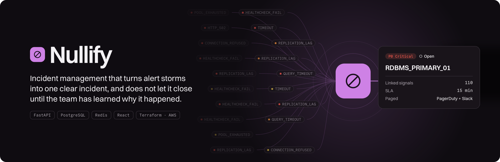

# Nullify

**Incident management that turns alert storms into one clear incident, and does not let it close until the team
has learned why it happened.**

[](https://github.com/Aswin-Shine/Nullify-Incident-Management-System/actions/workflows/ci.yml)


[](LICENSE)

[Features](#features) · [Screenshots](#screenshots) · [How it works](#how-it-works) ·
[Quick start](#quick-start) · [Architecture](#architecture) · [Deployment](#deployment) · [API](#api-reference)

</div>

---

## Overview

When a database falls over, every service that depends on it starts failing too, and monitoring fires hundreds of
alerts in a few seconds. On-call engineers get paged repeatedly for the same root problem, the real signal is
buried, and once things recover the incident is often closed without anyone writing down what went wrong.

Nullify sits between your monitoring and your team:

- **It absorbs the storm.** Every signal for a component attaches to that component's one open incident, so a
  burst of 100 alerts becomes one incident with 100 linked signals.
- **It routes by impact.** A database outage pages PagerDuty as P0; a cache hiccup posts to Slack as P2.
- **It enforces the follow-through.** An incident moves through a fixed workflow and cannot be closed until a Root
  Cause Analysis is submitted.
- **It keeps everyone on the same page.** Dashboards update live, every change is recorded in an audit history,
  and MTTR and SLA analytics show how the team is doing over time.

It is a full-stack web application (FastAPI, PostgreSQL, Redis, React) that ships with its own production setup:
Terraform for AWS, a GitHub Actions pipeline that tests, scans and deploys on every release tag, and a
Prometheus and Grafana monitoring stack.

---

## Features

### Signal intake
- **REST ingestion** of single signals or batches, authenticated with per-user API keys.
- **Backpressure, not data loss:** signals queue in memory and are written in batches; when a queue is full the
  API answers `429` so producers retry.
- **Debouncing in the database:** one open incident per component, guaranteed by a unique index, even with four
  worker processes racing.
- **Raw audit lake:** every signal is also appended to a JSONL log, replayable into the database.

### Triage and response
- **Automatic priority** from the component type (RDBMS, API, queue, MCP, cache) or the component's name.
- **Alert routing:** P0 and P1 page PagerDuty and post to Slack; P2 and P3 post to Slack only.
- **SLA deadlines** per priority, from 15 minutes for P0 to 24 hours for P3.
- **Assignment** to an engineer, and **comments** on every incident.

### Accountability
- **Enforced workflow:** `OPEN → INVESTIGATING → RESOLVED → CLOSED`, with illegal jumps rejected.
- **Mandatory RCA** before closing: incident window, root cause category, fix applied, prevention steps.
- **Audit history:** who changed what and when, written in the same transaction as the change.
- **Race-safe updates:** two people changing the same incident at once get a clear conflict, never a lost update.

### Visibility
- **Live dashboard** over WebSocket: new incidents and status changes appear without a refresh.
- **Incident list** with status, priority and "assigned to me" filters, component search and sorting.
- **Incident detail** with three tabs: linked signals, activity timeline, and the RCA.
- **Analytics:** open incidents, open P0s, average MTTR, SLA breach rate, MTTR by component, signal volume.
- **Command palette** (`Ctrl/Cmd + K`) to jump to any incident or action from the keyboard.
- **System status pill** showing the live-feed connection, API health and ingest queue depth.
- **Light and dark themes.**

### Teams and access
- **Invite-only accounts** with three roles: `viewer`, `sre`, `admin`.
- **User management** for admins; account deletion anonymises the user and keeps their history intact.
- **Self-service** password changes and API key rotation.

### Production-ready from day one
- Deploys to AWS from a git tag through GitHub Actions, with automatic rollback when a release is unhealthy.
- Prometheus metrics, 11 alert rules and a provisioned Grafana dashboard.
- TLS with automatic certificates, HSTS, a strict Content Security Policy and rate limiting.

---

## Screenshots

| Dashboard | Incident detail |
|---|---|
| 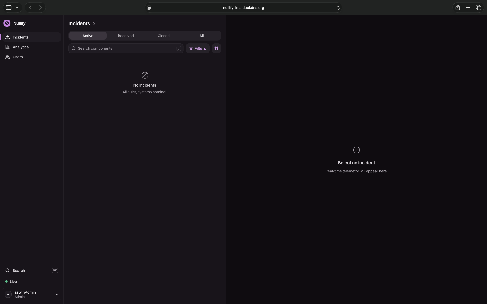 | 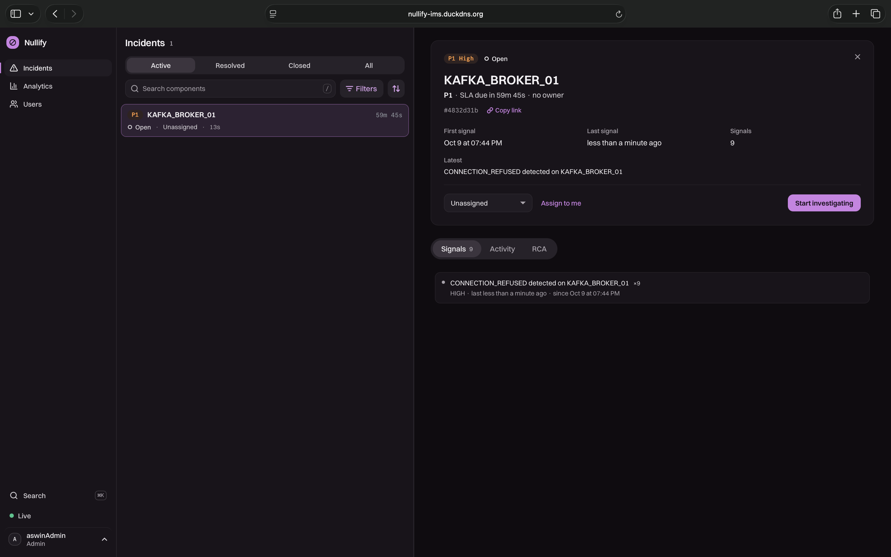 |
| **Root Cause Analysis** | **Analytics** |
| 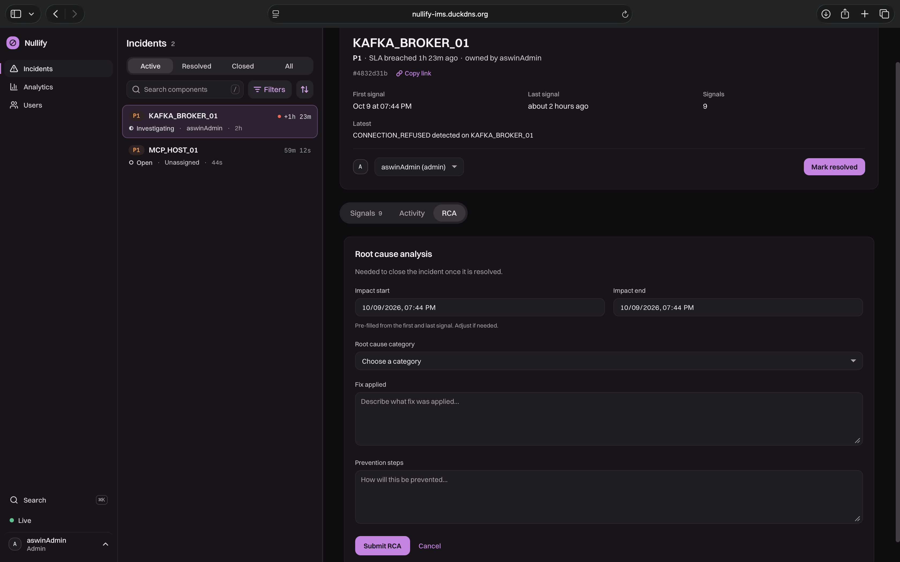 | 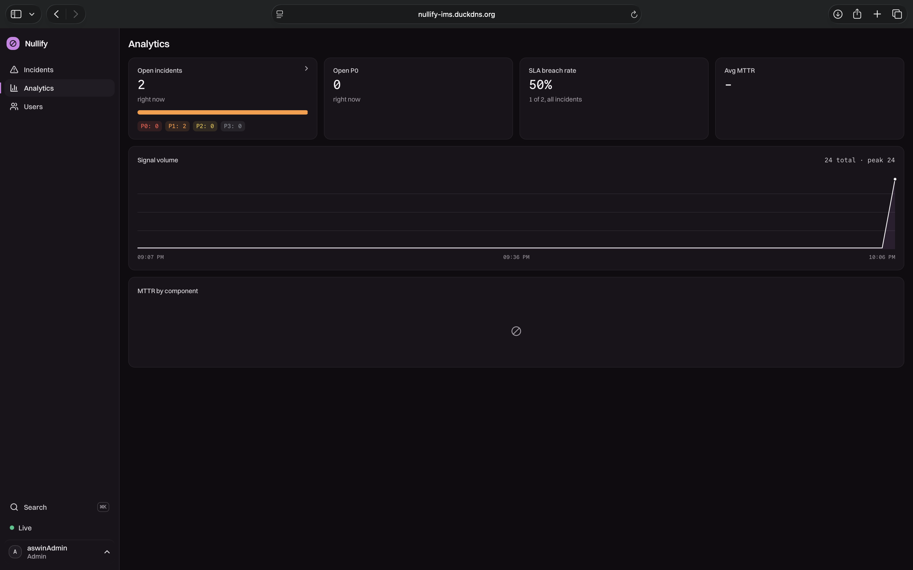 |
| **Sign in** | **Signal injector** |
| 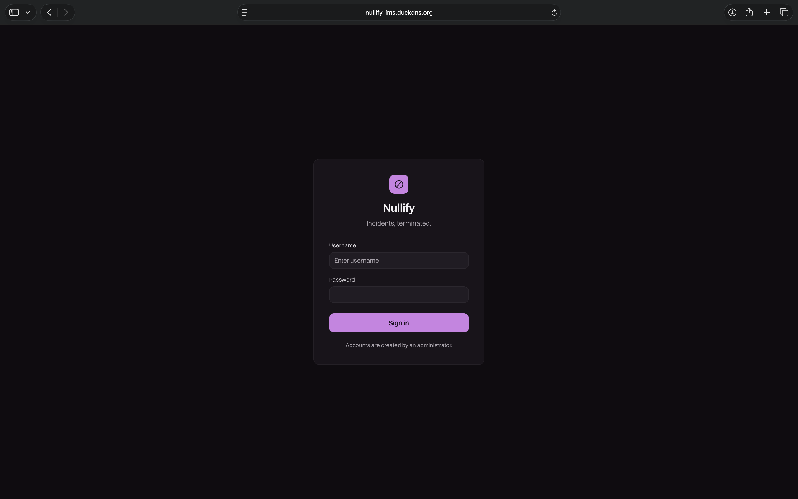 | 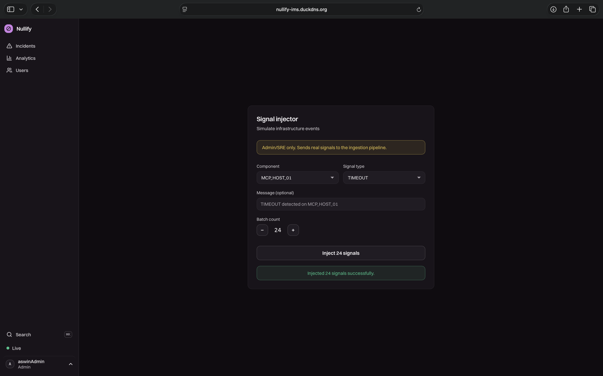 |

**Monitoring: the Grafana "Nullify overview" dashboard**

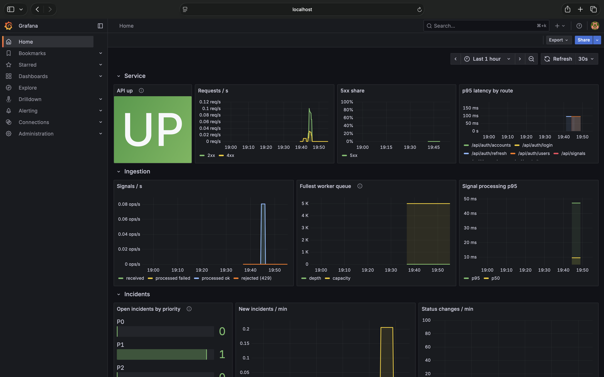

---

## How it works

### From signal to closed incident

1. **A signal arrives.** A monitoring tool or script sends `POST /api/signals` with a component ID, type and
   message. The API validates it, queues it and answers `202 Accepted` immediately.
2. **It is folded into an incident.** A background worker writes queued signals in batches. If the component
   already has an open incident, the signal is linked to it; otherwise a new incident is created.
3. **Priority and SLA are set.** The alert strategy for the component type decides the priority, the SLA
   deadline and which channels to notify.
4. **People are notified.** Slack and PagerDuty are called after the database commit, so a notification never
   describes an incident that failed to save.
5. **Dashboards update live.** The change is broadcast over WebSocket to every connected browser.
6. **The team works it.** An engineer takes it to `INVESTIGATING`, then `RESOLVED`, commenting along the way.
7. **The RCA is written.** Closing is refused until a Root Cause Analysis is on file. Submitting it records the
   MTTR: the time from the first signal to the RCA.
8. **It is closed.** The next signal for that component opens a fresh incident.

### Incident lifecycle

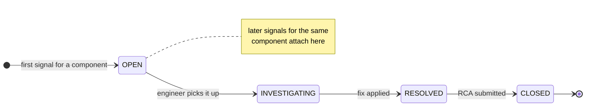
```mermaid
stateDiagram-v2
    direction LR
    [*] --> OPEN: first signal for a component
    OPEN --> INVESTIGATING: engineer picks it up
    INVESTIGATING --> RESOLVED: fix applied
    RESOLVED --> CLOSED: RCA submitted
    CLOSED --> [*]
    note right of OPEN
        later signals for the same
        component attach here
    end note
```

### Priority and routing

| Component type | Priority | Notified | SLA |
|---|---|---|---|
| RDBMS | P0 | PagerDuty + Slack | 15 min |
| API, Queue, MCP | P1 | PagerDuty + Slack | 1 hour |
| Cache | P2 | Slack | 4 hours |
| Anything else | P3 | Slack | 24 hours |

The type comes from the signal's `component_type` field, or is inferred from the component ID (`RDBMS_PRIMARY_01`
is treated as RDBMS).

---

## Quick start

### With Docker (recommended)

Requirements: Docker with the Compose plugin.

```bash
git clone https://github.com/Aswin-Shine/Nullify-Incident-Management-System.git
cd Nullify-Incident-Management-System
cp .env.example .env              # set DB_PASSWORD and APP_SECRET_KEY (openssl rand -hex 32)

docker compose build
docker compose run --rm migrate   # create the database schema
docker compose up -d              # http://localhost

# create the first admin (prompts for a password)
docker compose exec backend python -m app.cli create-user --username admin --email admin@example.com --role admin
```

Optional monitoring stack (set `GRAFANA_ADMIN_PASSWORD` in `.env` first):

```bash
docker compose --profile monitoring up -d   # Grafana http://localhost:3001, Prometheus http://localhost:9090
```

### Without Docker

Requirements: Python 3.12, Node 22, PostgreSQL 16 and Redis 7 running locally.

```bash
cp .env.example .env              # point DB_* and REDIS_* at your local services
./start.sh                        # virtualenv, migrations, backend on :8000, frontend on :5173
cd backend && python -m app.cli create-user --username admin --email admin@example.com --role admin
```

### See it in action

With the stack running, simulate an outage: a database failure that cascades into the MCP layer, followed by a
burst of 110 signals that all fold into one incident.

```bash
MOCK_USERNAME=admin MOCK_PASSWORD=<your password> python mock_events.py
```

Or open the **Signal injector** from the account menu and send signals from the browser.

---

## Usage

### Roles

| | viewer | sre | admin |
|---|:---:|:---:|:---:|
| See incidents, signals, analytics | ✓ | ✓ | ✓ |
| Comment on incidents | ✓ | ✓ | ✓ |
| Send signals | | ✓ | ✓ |
| Change status, assign, submit RCAs | | ✓ | ✓ |
| Create, edit and remove accounts | | | ✓ |

### Sending signals from your tools

Create an API key in the **Account** panel (it is shown once), then:

```bash
curl -X POST https://<your-domain>/api/signals \
  -H "X-API-Key: $NULLIFY_API_KEY" \
  -H "Content-Type: application/json" \
  -d '{
        "component_id": "RDBMS_PRIMARY_01",
        "component_type": "RDBMS",
        "signal_type": "CONNECTION_REFUSED",
        "message": "Primary not accepting connections",
        "severity": "CRITICAL"
      }'
# 202 {"status": "accepted", "component_id": "RDBMS_PRIMARY_01"}
```

| Field | Required | Notes |
|---|---|---|
| `component_id` | yes | Letters, digits, `_ . -`, up to 64 characters; stored uppercase |
| `component_type` | no | `RDBMS`, `CACHE`, `QUEUE`, `API` or `MCP`; inferred from the ID when omitted |
| `signal_type` | yes | Up to 64 characters |
| `message` | yes | Up to 4,096 characters |
| `severity` | no | Defaults to `MEDIUM` |
| `metadata` | no | Any JSON object, up to 8 KB |
| `timestamp` | no | Event time; defaults to now |

Send many at once with `POST /api/signals/batch` and a JSON array; the response counts accepted and rejected
signals. A `429` means the queue is full or you hit the rate limit: back off and retry.

### Working an incident

Open an incident from the list, move it to **Investigating**, assign it, and use comments to keep the team
informed. Once fixed, mark it **Resolved**, fill in the **RCA** tab, and **Close** it. Everything you do appears
in the **Activity** tab and on every teammate's screen in real time.

---

## Architecture

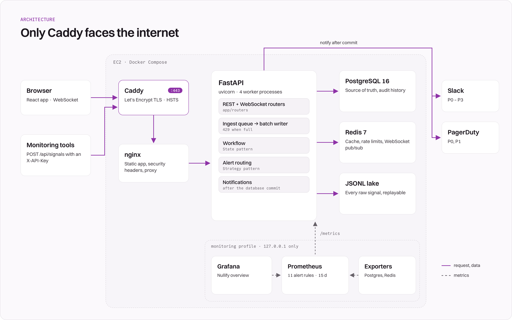

| Layer | Technology |
|---|---|
| Frontend | React 19, Vite, HeroUI v3, Tailwind CSS v4, served by nginx |
| API | FastAPI on uvicorn (4 worker processes), Pydantic v2 |
| Database | PostgreSQL 16 through SQLAlchemy 2 (async) and asyncpg; schema managed by Alembic |
| Cache and messaging | Redis 7: read cache, rate-limit counters, WebSocket fan-out over pub/sub |
| Realtime | WebSocket, authenticated on the first message, re-checked every 60 seconds |
| Edge | Caddy: automatic Let's Encrypt TLS, HSTS |
| Observability | Prometheus, Grafana, Postgres and Redis exporters, optional OpenTelemetry tracing |
| Infrastructure | Docker Compose on AWS EC2, provisioned with Terraform, deployed by GitHub Actions |

**Request path:** browser → Caddy (TLS) → nginx (static app, security headers, proxy) → FastAPI → PostgreSQL and
Redis. Only Caddy is reachable from the internet; the database, Redis and the API have no public port.

**Data:**

| Store | Holds |
|---|---|
| PostgreSQL | The source of truth: incidents, signals, RCAs, comments, users, audit history |
| Redis | Short-lived data only: cached list pages, rate-limit counters, realtime events. Never on the ingest path. |
| JSONL lake | An append-only copy of every raw signal, replayable with `python -m app.cli replay-lake` |

**Design patterns.** The workflow uses the **State** pattern (`backend/app/services/state_machine.py`): each
status is a class that knows its legal next steps. Priority and routing use the **Strategy** pattern
(`backend/app/services/alert_strategy.py`): one strategy per component type, so adding a type is one class.

**Reliability choices.**
- Services commit to the database first and only then invalidate caches, broadcast and notify.
- Status changes are compare-and-set in SQL, so concurrent edits cannot overwrite each other.
- A transient database error never drops a signal: the worker holds it and retries, and the signal routes answer
  `503` until Postgres is back.
- `/health` fails only on what stops signals being stored (Postgres, the ingest circuit breaker, shutdown); a Redis
  outage is reported but does not take the service out of rotation.

---

## Configuration

All settings live in one file, `.env` at the repository root (template: [`.env.example`](.env.example); the
server uses [`.env.server.example`](.env.server.example)).

| Variable | Purpose |
|---|---|
| `APP_ENV` | `development` or `production`. Production disables the API docs and refuses weak secrets. |
| `APP_SECRET_KEY` | Signs tokens. At least 32 characters in production. |
| `DB_HOST`, `DB_PORT`, `DB_USER`, `DB_PASSWORD`, `DB_NAME` | PostgreSQL connection |
| `REDIS_HOST`, `REDIS_PORT`, `REDIS_PASSWORD`, `REDIS_DB` | Redis connection |
| `ALLOWED_ORIGINS` | JSON list of browser origins, including the port (e.g. `["https://ims.example.com"]`) |
| `JWT_ACCESS_TOKEN_EXPIRE_MINUTES`, `JWT_REFRESH_TOKEN_EXPIRE_DAYS` | Session lifetime (15 minutes, 7 days) |
| `SLACK_WEBHOOK_URL`, `PAGERDUTY_ROUTING_KEY` | Notification channels; leave empty to disable |
| `OTLP_ENDPOINT` | OpenTelemetry collector for traces; empty disables tracing |
| `GRAFANA_ADMIN_PASSWORD` | Required by the monitoring profile |
| `COMPOSE_PROFILES` | On a server: `tls`, or `tls,monitoring` |

---

## API reference

Interactive OpenAPI docs are served at `/docs` outside production.

| Area | Endpoints |
|---|---|
| Signals | `POST /api/signals`, `POST /api/signals/batch` |
| Incidents | `GET /api/work-items`, `GET /api/work-items/{id}`, `PATCH /api/work-items/{id}/status`, `PATCH /api/work-items/{id}/assign` |
| Incident data | `GET /api/work-items/{id}/signals`, `GET /api/work-items/{id}/history`, `GET`/`POST /api/work-items/{id}/comments`, `GET`/`POST /api/work-items/{id}/rca` |
| Analytics | `GET /api/work-items/analytics/mttr`, `GET /api/work-items/analytics/sla`, `GET /api/timeseries` |
| Auth | `POST /api/auth/login`, `POST /api/auth/refresh`, `POST /api/auth/logout`, `POST /api/auth/password`, `POST /api/auth/api-key`, `GET /api/auth/me` |
| Users (admin) | `GET`/`POST /api/auth/users`, `PATCH`/`DELETE /api/auth/users/{id}` |
| Health and realtime | `GET /health`, `GET /health/live`, `WS /ws` |

---

## Testing

```bash
cd backend && pip install -r requirements-dev.txt && pytest   # 328 tests; needs local Postgres + Redis
cd frontend && npm test                                       # 531 tests; no backend needed
cd frontend && npm run lint && npm run build
docker run --rm -v "$PWD/infra:/infra:ro" ubuntu:24.04 bash /infra/deploy_test.sh   # deploy script
```

- **Backend** tests run against a real PostgreSQL (a throwaway `ims_test` database built by Alembic), because the
  SQL under test is Postgres-specific. They cover ingestion and debouncing, the workflow and RCA rules, race
  conditions (by forcing real lock contention), auth and rate limits, and the deployment config. CI requires 80%
  coverage.
- **Frontend** tests use Vitest and Testing Library for every component.
- **Alert rules** are unit-tested with promtool; the **deploy script** is tested on every rollback path.

---

## Deployment

Nullify runs in production as one Docker Compose stack on a single AWS EC2 instance. Infrastructure is code,
releases are git tags, and nothing in CI holds a long-lived credential.

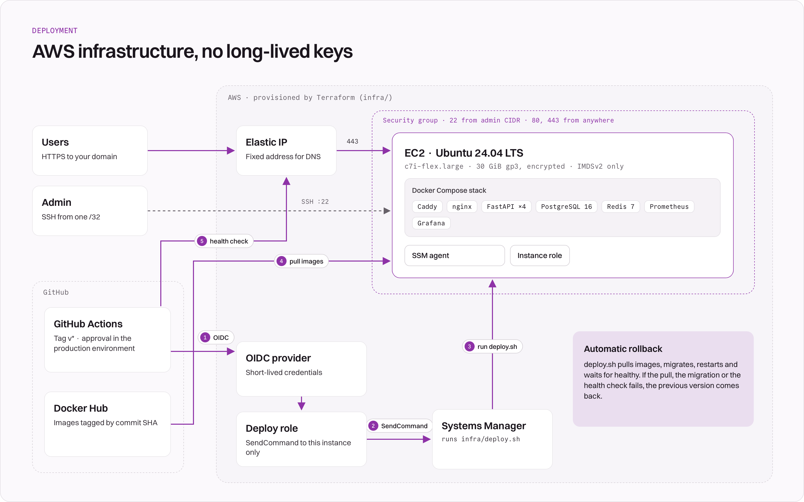

### Infrastructure (Terraform)

[`infra/`](infra) provisions:

| Resource | Details |
|---|---|
| EC2 instance | Ubuntu 24.04 LTS, `c7i-flex.large` (free-tier eligible), encrypted 30 GiB gp3 volume, IMDSv2 only. First boot installs Docker; no secrets and no app in user data. |
| Elastic IP | A fixed address for the domain's DNS record |
| Security group | SSH from one admin CIDR only (`0.0.0.0/0` is rejected); HTTP and HTTPS from anywhere. Grafana and Prometheus are never exposed. |
| GitHub OIDC provider + deploy role | Lets GitHub Actions assume a role with short-lived credentials, only from this repository's `production` environment. The role can only send an SSM command to this one instance. |
| Instance role | Lets the SSM agent receive deploy commands, so port 22 never opens to GitHub. |

```bash
cd infra
cp terraform.tfvars.example terraform.tfvars   # set ssh_cidr to your IP/32
terraform init && terraform apply
```

### CI/CD (GitHub Actions)

| Trigger | What happens |
|---|---|
| Pull request | Tests, security scans and image builds. Nothing is pushed or deployed. |
| Push to `main` | Nothing runs. |
| Push a `v*` tag | Full pipeline, then the images are pushed and the release is deployed. |
| Manual **Deploy** run | Redeploys an earlier commit (rollback). |

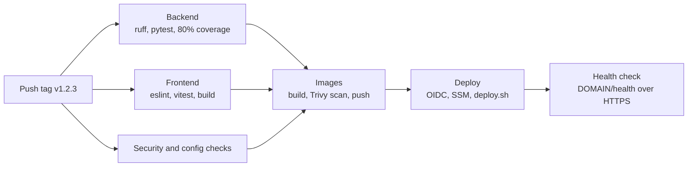
```mermaid
flowchart LR
    tag["Push tag v1.2.3"] --> backend["Backend<br/>ruff, pytest, 80% coverage"]
    tag --> frontend["Frontend<br/>eslint, vitest, build"]
    tag --> checks["Security and config checks"]
    backend --> images["Images<br/>build, Trivy scan, push"]
    frontend --> images
    checks --> images
    images --> deploy["Deploy<br/>OIDC, SSM, deploy.sh"]
    deploy --> health["Health check<br/>DOMAIN/health over HTTPS"]
```

- **Security and config checks:** gitleaks over the full history, pip-audit, npm audit, bandit, zizmor on the
  workflows, Terraform fmt and validate, promtool alert tests, the deploy script's tests, and a check that the
  tag points at a commit on `main`.
- **Images** are built for `linux/amd64`, scanned with Trivy (any fixable CRITICAL or HIGH fails the run) and
  tagged with the commit SHA, never `latest`.
- **Supply chain:** actions are pinned to commit SHAs and kept current by Dependabot; workflows start with no
  permissions and each job requests only what it needs.

### What a deploy does

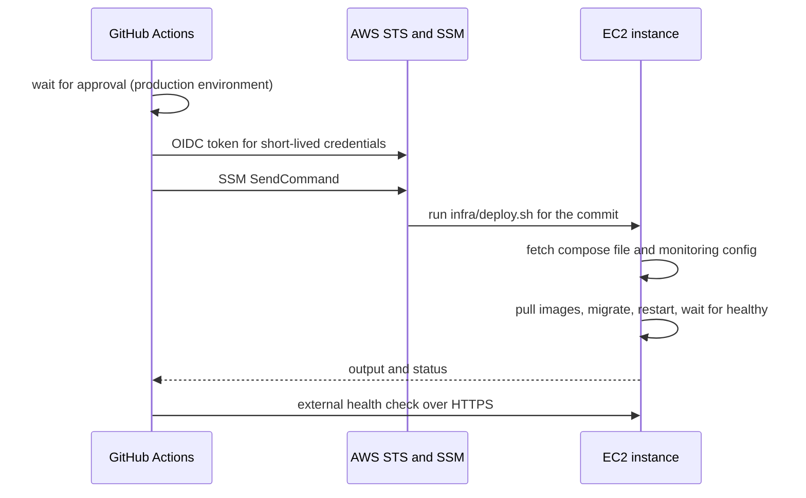
```mermaid
sequenceDiagram
    participant GH as GitHub Actions
    participant AWS as AWS STS and SSM
    participant EC2 as EC2 instance
    GH->>GH: wait for approval (production environment)
    GH->>AWS: OIDC token for short-lived credentials
    GH->>AWS: SSM SendCommand
    AWS->>EC2: run infra/deploy.sh for the commit
    EC2->>EC2: fetch compose file and monitoring config
    EC2->>EC2: pull images, migrate, restart, wait for healthy
    EC2-->>GH: output and status
    GH->>EC2: external health check over HTTPS
```

[`infra/deploy.sh`](infra/deploy.sh) restores the previous version automatically if the image pull, the database
migration or the post-restart health check fails, and it reloads Prometheus so new alert rules take effect.

**Release:**

```bash
git tag v1.2.3 && git push origin v1.2.3
```

**Roll back:** Actions → **Deploy** → **Run workflow** → the commit SHA of an earlier release. Its images are
already on Docker Hub, so nothing is rebuilt.

Step-by-step setup for your own AWS account and GitHub repository: [`infra/README.md`](infra/README.md) and
[`.github/CICD_SETUP.md`](.github/CICD_SETUP.md).

---

## Monitoring

The `monitoring` Compose profile adds Prometheus (15-day retention), Grafana with the provisioned **Nullify
overview** dashboard, and exporters for PostgreSQL and Redis. Both UIs listen on localhost only; on a server, use
an SSH tunnel:

```bash
ssh -L 3001:127.0.0.1:3001 ubuntu@<server-ip>   # then open http://localhost:3001
```

The backend exports request metrics plus application metrics (`nullify_*`): signals received, rejected and
processed, processing latency, queue depth, incidents created, state transitions, open incidents, WebSocket
connections, database retries and failed notifications. Metrics are aggregated across all four worker processes.

| Alert | Fires when |
|---|---|
| `NullifyApiDown`, `PostgresDown`, `RedisDown` | a service stops answering for 1 minute |
| `IngestQueueFilling` | an ingest queue is over 80% full for 2 minutes |
| `SignalsDropped`, `SignalProcessingFailing` | signals are rejected or fail to store |
| `IngestBlockedOnDatabase`, `DbRetriesSpiking` | the database is down or flapping |
| `NotificationsFailing` | Slack or PagerDuty deliveries fail |
| `HighErrorRate` | more than 5% of requests fail for 5 minutes |
| `SlowRequests` | p95 latency above 1 second for 10 minutes |


---

## Security

| Area | Measures |
|---|---|
| Transport | HTTPS only with automatic Let's Encrypt certificates, HTTP redirected, HSTS for one year |
| Browser | Strict Content Security Policy: no inline scripts or styles, no third-party hosts |
| Sessions | 15-minute access tokens held in memory only; refresh token in an httpOnly cookie, 7-day maximum session, CSRF header required; changing a password revokes every other session |
| Access | Invite-only accounts, role-based permissions, hashed API keys usable only for sending signals |
| Abuse | Rate limits on signal ingestion (per key) and logins (per IP, enforced even if Redis is down) |
| Pipeline | Secret scanning, dependency audits, static analysis and image scanning on every run; no stored cloud keys |
| Infrastructure | SSH restricted to one address, encrypted disk, IMDSv2, deploys over SSM |

Found a vulnerability? Please report it privately as described in [SECURITY.md](SECURITY.md).

---

## Performance

Measured with [`backend/bench_ingest.py`](backend/bench_ingest.py): a backlog drained by four processes all
writing to the same incident (the worst case for contention), on a laptop, 2026-10-07.

| Write strategy | Throughput |
|---|---|
| One signal per transaction | about 525 signals/s |
| Batched, one transaction per component per batch (current) | about 17,400 signals/s |

---

## Project structure

```
backend/
  app/routers/            HTTP and WebSocket endpoints
  app/services/           ingestion, workflow (State), alert routing (Strategy), notifications
  app/db/  app/models/    database access, retry logic, schemas
  alembic/                database migrations
  tests/                  pytest suite
frontend/
  src/components/         React components and their tests
  src/api/  src/hooks/    API client with token refresh, data-fetching hooks
  nginx.conf              static serving, security headers, reverse proxy
infra/                    Terraform (EC2, IAM, OIDC) and the deploy script
monitoring/               Prometheus config and alert rules, Grafana dashboard
.github/workflows/        CI and deploy pipelines
docker-compose.yml        the full stack; profiles: tls, monitoring, migrate
mock_events.py            outage simulator
```

---

## Roadmap and known limitations

Nullify is deliberately a single-server deployment today. Known gaps, roughly in the order they will be addressed:

- **Backups:** PostgreSQL lives on the instance's disk with no automated backups yet.
- **Alert delivery:** alert rules evaluate in Prometheus, but there is no Alertmanager to send them anywhere.
- **High availability:** one instance is a single point of failure. The application already scales horizontally
  (stateless workers, Redis pub/sub, database-enforced debouncing); the infrastructure does not yet.
- **In-memory queue:** signals accepted but not yet written are lost if a backend process crashes hard.
- **Terraform state** is kept locally; it should move to S3 before more than one person manages the infrastructure.

---

## Contributing

1. Fork the repository and create a branch.
2. Run the backend and frontend tests and the linters locally.
3. Open a pull request; CI runs the full test and security suite on it.

Database changes need an Alembic migration (`alembic revision -m "..." --rev-id 00NN`), and every change to an
incident must write an audit-history row in the same transaction.

---

## License

Released under the [MIT License](LICENSE).
