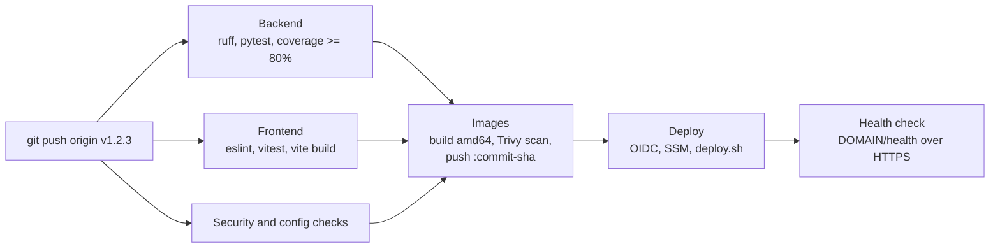
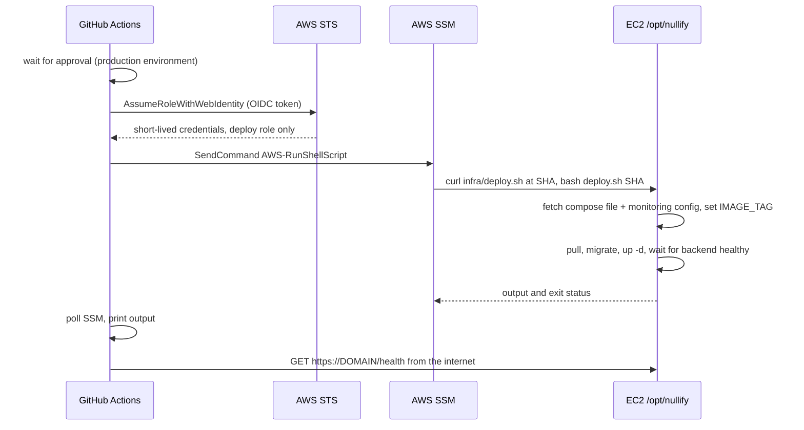

# Nullify: Incident Management System


[](https://github.com/Aswin-Shine/Nullify-Incident-Management-System/actions/workflows/ci.yml)


[](LICENSE)

Nullify takes failure signals from monitored components, folds each burst into a single incident, routes it by
priority to Slack and PagerDuty, and does not let anyone close it until a Root Cause Analysis is on file.

This README is written from the platform side: how the system is built, provisioned, shipped and watched. It runs
as one Docker Compose stack on a single EC2 instance, provisioned by Terraform and deployed by GitHub Actions
through AWS SSM. No SSH keys or AWS access keys are stored in CI.

## Contents

- [Architecture](#architecture)
- [AWS infrastructure (Terraform)](#aws-infrastructure-terraform)
- [CI/CD pipeline](#cicd-pipeline)
- [Runtime: the Compose stack](#runtime-the-compose-stack)
- [Observability](#observability)
- [Security](#security)
- [The application](#the-application)
- [Performance](#performance)
- [Local development](#local-development)
- [Deploying your own copy](#deploying-your-own-copy)
- [Operations runbook](#operations-runbook)
- [Repository layout](#repository-layout)
- [Known limitations](#known-limitations)
- [License](#license)

---

## Architecture


**Request path.** Internet → Caddy (TLS, HSTS, ports 80/443) → nginx in the frontend container (static React
build, CSP, proxies `/api` `/ws` `/health`) → FastAPI backend (uvicorn, 4 worker processes) → PostgreSQL 16 and
Redis 7. Only Caddy publishes ports to the internet. Postgres, Redis and the backend have no published port at all.

**Signal path.** `POST /api/signals` (or `/api/signals/batch`) validates the payload and puts it on an in-process
`asyncio.Queue` in the worker that took the request; a full queue answers `429` so producers back off. Ingestion
workers drain up to 200 signals at a time and write them in one transaction per component: upsert the active
incident, insert the linked signal rows, bump the per-minute time series. The raw signals are then appended to a
JSONL audit lake.

| Store | Role |
|---|---|
| PostgreSQL 16 | Source of truth: incidents, signals, RCAs, comments, users, the audit history. Schema owned by Alembic. |
| Redis 7 | Short-TTL read cache, rate-limit counters, and the pub/sub channel that fans WebSocket events out to all 4 workers. Not on the ingest path. |
| JSONL lake | Append-only raw signal log on the data volume, replayable with `python -m app.cli replay-lake`. |

---

## AWS infrastructure (Terraform)


Everything lives in [`infra/`](infra): one EC2 instance in the default VPC, plus the IAM that lets GitHub
Actions deploy to it without keys. Terraform state is local and gitignored.

| Resource | What it is | Why |
|---|---|---|
| `aws_instance.nullify` | Ubuntu 24.04 LTS, `c7i-flex.large` (2 vCPU, 4 GiB), free-tier eligible | Runs the whole Compose stack. AMI read from Canonical's SSM parameter, so it is the current image at create time. |
| root volume | 30 GiB gp3, encrypted | Postgres, Redis and the signal lake live here. |
| `metadata_options` | IMDSv2 only (`http_tokens = "required"`) | Blocks SSRF-style credential theft through the metadata service. |
| `user_data` | Installs Docker Engine and the Compose plugin from Docker's apt repo, creates `/opt/nullify` | First boot only. It holds no secrets and no app; deploys do the rest. |
| `aws_eip.nullify` | Elastic IP | A fixed address for the DNS A record that survives stop/start. |
| `aws_security_group.nullify` | Ingress: 22/tcp from `ssh_cidr` only, 80/tcp and 443/tcp+udp from anywhere | `ssh_cidr` is validated and cannot be `0.0.0.0/0`. Grafana and Prometheus are never opened; reach them through an SSH tunnel. |
| `aws_iam_openid_connect_provider.github` | GitHub's OIDC issuer | CI gets short-lived AWS credentials per run; no stored access keys. |
| `aws_iam_role.github_deploy` | Assumable only by this repo's `production` environment | Trust pinned on the `sub` claim, including the form with numeric owner and repo IDs, so a renamed or recreated repo cannot match it. |
| `aws_iam_role_policy.github_deploy` | `ssm:SendCommand` on this one instance and `AWS-RunShellScript` only | The deploy role can run a shell script on the box and nothing else. |
| `aws_iam_role.instance` + profile | `AmazonSSMManagedInstanceCore` | Lets the SSM agent (preinstalled on Canonical's AMIs) register and take commands. Port 22 stays closed to GitHub. |

Two decisions are deliberate:

- `ignore_changes = [ami, user_data]`: a new Ubuntu image or an edited bootstrap script never replaces the
  running box (and its data).
- No secrets in Terraform. The server's `.env` is copied once by hand (`.env.server.example` is the template)
  and is never written by Terraform or CI. CI only updates the `IMAGE_TAG=` line in it.

```bash
cd infra
cp terraform.tfvars.example terraform.tfvars   # set ssh_cidr to your IP/32
terraform init && terraform apply
terraform output                                # public_ip, instance_id, github_deploy_role_arn
```

---

## CI/CD pipeline

Two workflows in [`.github/workflows`](.github/workflows). Setup checklist: [`.github/CICD_SETUP.md`](.github/CICD_SETUP.md).

| Trigger | What runs |
|---|---|
| Pull request | Tests, scans and image builds. Nothing is pushed or deployed. |
| Push to `main` | Nothing. Small commits cost no CI minutes. |
| Push a `v*` tag | Everything, then pushes the images and deploys that commit. |
| Manual run of **Deploy** | Deploys any earlier commit SHA (rollback). Builds nothing. |


```mermaid
flowchart LR
    tag["git push origin v1.2.3"] --> backend["Backend<br/>ruff, pytest, coverage >= 80%"]
    tag --> frontend["Frontend<br/>eslint, vitest, vite build"]
    tag --> checks["Security and config checks"]
    backend --> images["Images<br/>build amd64, Trivy scan,<br/>push :commit-sha"]
    frontend --> images
    checks --> images
    images --> deploy["Deploy<br/>OIDC, SSM, deploy.sh"]
    deploy --> health["Health check<br/>DOMAIN/health over HTTPS"]
```

### Jobs (`ci.yml`)

| Job | Steps |
|---|---|
| **Backend** | Postgres 16 and Redis 7 service containers; `ruff check`; full pytest suite (328 tests) with `--cov-fail-under=80`. |
| **Frontend** | Node 22; `npm ci`, eslint, vitest (531 tests), production build. |
| **Security and config checks** | Tag-is-on-main guard; gitleaks over the whole git history; pip-audit; `npm audit --omit=dev`; bandit; zizmor on the workflows themselves; `deploy_test.sh` (every rollback path of the deploy script); `terraform fmt -check` and `validate`; promtool unit tests for the alert rules; `docker compose config` with every profile. |
| **Docker images** | Builds both images for `linux/amd64` with a GitHub Actions layer cache; Trivy fails the run on any CRITICAL or HIGH vulnerability that has a fix; on a tag, pushes `aswinshine/nullify-backend:<sha>` and `aswinshine/nullify-frontend:<sha>` to Docker Hub. |
| **Deploy** | Calls `deploy.yml` with the commit SHA. |

Images are tagged with the full commit SHA, never `latest`, so what runs on the box is always traceable to one
commit and a rollback is just an older SHA.

### Deploy (`deploy.yml`)


```mermaid
sequenceDiagram
    participant GH as GitHub Actions
    participant STS as AWS STS
    participant SSM as AWS SSM
    participant EC2 as EC2 /opt/nullify
    GH->>GH: wait for approval (production environment)
    GH->>STS: AssumeRoleWithWebIdentity (OIDC token)
    STS-->>GH: short-lived credentials, deploy role only
    GH->>SSM: SendCommand AWS-RunShellScript
    SSM->>EC2: curl infra/deploy.sh at SHA, bash deploy.sh SHA
    EC2->>EC2: fetch compose file + monitoring config, set IMAGE_TAG
    EC2->>EC2: pull, migrate, up -d, wait for backend healthy
    EC2-->>SSM: output and exit status
    GH->>GH: poll SSM, print output
    GH->>EC2: GET https://DOMAIN/health from the internet
```

`infra/deploy.sh` is the only thing that changes the server, and it is defensive:

- Downloads `docker-compose.yml` and the `monitoring/` config **at the deployed commit**, so the box always runs
  a matching set of files.
- If `docker compose pull` or the migration fails, it puts the previous compose file and `IMAGE_TAG` back.
  Nothing has restarted at that point, so the old version keeps serving.
- After `up -d` it waits up to 2 minutes for the backend healthcheck. If the backend is not healthy, it restores
  the previous version and restarts it.
- Reloads Prometheus (SIGHUP) so new alert rules apply, and prunes images older than a week while keeping recent
  ones for rollbacks.
- Every path is covered by `infra/deploy_test.sh`, which runs in CI against stubbed `docker` and `curl`.

Deploys are serialized (`concurrency: deploy-production`, never cancelled halfway), and the external health check
proves DNS, the certificate, Caddy, nginx and the backend all work together.

### Supply chain hardening

- Every third-party action is pinned to a full commit SHA; Dependabot opens weekly PRs for actions, pip, npm and
  Docker base images.
- Workflows start from `permissions: {}`; each job asks only for what it needs (`id-token: write` only for the
  deploy).
- `persist-credentials: false` on every checkout; zizmor audits the workflows on every run.
- No pip/npm cache in a workflow that deploys, so a PR cannot poison a cache that a release later restores.

### Releasing and rolling back

```bash
git checkout main && git pull
git tag v1.2.3 && git push origin v1.2.3     # CI, images, deploy
```

Roll back: Actions → **Deploy** → **Run workflow** → paste the full SHA of an earlier release. Its images are
already on Docker Hub, so nothing is rebuilt. Migrations are not reversed, so choose a commit whose code works
with the current schema.

---

## Runtime: the Compose stack

One `docker-compose.yml` runs the stack everywhere. Profiles add the production edge and the monitoring stack.

| Service | Image | Published on the host | Profile |
|---|---|---|---|
| `caddy` | `caddy:2.11-alpine` | `80`, `443` | `tls` |
| `frontend` | `aswinshine/nullify-frontend:<sha>` (nginx) | `FRONTEND_PORT` (`127.0.0.1:3000` behind Caddy) | default |
| `backend` | `aswinshine/nullify-backend:<sha>` (uvicorn, 4 workers) | none | default |
| `postgres` | `postgres:16-alpine` | none | default |
| `redis` | `redis:7-alpine` (256 MB, `volatile-lru`) | none | default |
| `migrate` | backend image, `alembic upgrade head` | none | `migrate` (one-off) |
| `prometheus` | `prom/prometheus:v3.5.0` | `127.0.0.1:9090` | `monitoring` |
| `grafana` | `grafana/grafana-oss:12.1.1` | `127.0.0.1:3001` | `monitoring` |
| `postgres-exporter`, `redis-exporter` | community exporters | none | `monitoring` |

On the server, `.env` sets `COMPOSE_PROFILES=tls` (or `tls,monitoring`).

**Networks.** Two bridges. `edge` holds only Caddy and the frontend, so Caddy can never reach Postgres or Redis.
Caddy has a pinned address (`10.254.254.2`) and the network's dynamic range starts above it; nginx trusts
`X-Forwarded-For` only from that address and overwrites it otherwise, so a client cannot choose the IP the login
rate limit counts. nginx resolves the backend through Docker DNS at request time, so a recreated backend never
leaves it with a stale address.

**Container hardening.** `no-new-privileges` on every service; the backend runs as a non-root user with
`cap_drop: [ALL]` and a 1.5 GB memory limit sized so four full ingest queues cannot take the host down.
Healthchecks on every long-running service.

**Schema.** Alembic owns it. The backend refuses to start unless the database is at head, and every deploy runs
`docker compose run --rm migrate` before restarting anything.

**Health.** `/health/live` is the liveness probe. `/health` gates only on what stops signals from being stored
(Postgres, the ingest circuit breaker, shutdown), and reports Redis and queue depth as detail fields, so a Redis
blip does not take the service out of a load balancer.

---

## Observability


`docker compose --profile monitoring up -d` adds Prometheus (15-day retention), Grafana with a provisioned
datasource and the **Nullify overview** dashboard, and exporters for Postgres and Redis. Both UIs listen on
`127.0.0.1` only. On the server:

```bash
ssh -L 3001:127.0.0.1:3001 -L 9090:127.0.0.1:9090 ubuntu@<public_ip>
# Grafana: http://localhost:3001 (admin / GRAFANA_ADMIN_PASSWORD)   Prometheus: http://localhost:9090
```

**Metrics.** The backend exports HTTP metrics plus its own `nullify_*` series: signals received, rejected and
processed, processing latency, ingest queue depth and capacity, batch size, DB-down and DB-retry counters,
incidents created, state transitions, open incidents, WebSocket connections and failed notifications. Uvicorn
runs 4 processes, so metrics use Prometheus multiprocess mode and one scrape sums every worker.

**Alert rules** (`monitoring/prometheus/alerts.yml`, unit-tested with promtool in CI):

| Alert | Fires when |
|---|---|
| `NullifyApiDown`, `PostgresDown`, `RedisDown` | a target stops answering for 1 minute |
| `IngestQueueFilling` | the fullest ingest queue is over 80% for 2 minutes |
| `SignalsDropped`, `SignalProcessingFailing` | signals are rejected or fail to store |
| `IngestBlockedOnDatabase` | ingestion is waiting on Postgres |
| `DbRetriesSpiking` | transient DB errors are climbing |
| `NotificationsFailing` | Slack or PagerDuty deliveries fail |
| `HighErrorRate` | over 5% of requests are 5xx for 5 minutes |
| `SlowRequests` | p95 latency over 1 s for 10 minutes |


**Tracing** is optional: set `OTLP_ENDPOINT` and the FastAPI routes export OpenTelemetry spans over OTLP/gRPC.

---

## Security

| Layer | Control |
|---|---|
| Edge | Caddy gets and renews a Let's Encrypt certificate, redirects HTTP to HTTPS, sends HSTS (1 year), strips the `Server` header. |
| Browser | nginx sends a strict CSP (no inline scripts or styles, no third-party hosts; fonts are vendored). |
| Accounts | Invite-only. Login returns a 15-minute access token kept only in memory; the refresh token is an httpOnly cookie scoped to `/api/auth` that is never renewed, so a session lasts 7 days at most. Refresh and logout also require an `X-Requested-With` header (CSRF). A password change or account removal revokes every token through a per-user token version. |
| Roles | `admin`, `sre`, `viewer`. Signals need `sre` or `admin`. |
| Producers | Hashed API keys (`X-API-Key`), accepted only on the two signal routes. |
| Rate limits | 2,000 signals/s per principal; 10 login attempts per minute per client IP, with a per-process fallback so logins stay limited even when Redis is down. |
| Secrets | Only in the server's `.env` and in GitHub secrets. Production refuses an `APP_SECRET_KEY` shorter than 32 characters. |
| CI | gitleaks, pip-audit, npm audit, bandit, Trivy, zizmor on every run; SHA-pinned actions; OIDC instead of stored cloud keys. |
| Host | SSH only from one CIDR, IMDSv2 only, encrypted volume, deploys through SSM instead of SSH. |

Users are never hard-deleted: deleting an account anonymises it, so the incident history and comments stay intact.

Found a vulnerability? Report it privately as described in [SECURITY.md](SECURITY.md), not in a public issue.

---

## The application

| | |
|---|---|
| **Debounce** | One open incident per component, enforced in Postgres by a partial unique index and `INSERT ... ON CONFLICT`. A burst of 100 signals for a component becomes one incident with 100 linked signals. After it is resolved, the next signal opens a new one. |
| **Workflow** | State pattern (`state_machine.py`): `OPEN → INVESTIGATING → RESOLVED → CLOSED`. Closing requires a submitted RCA (start and end time, root cause category, fix applied, prevention steps). Status changes are compare-and-set, so two people racing get a clean `409`. |
| **Priority and routing** | Strategy pattern (`alert_strategy.py`), picked by the signal's `component_type` or by tokens in the component ID: RDBMS P0; API, queue and MCP P1; cache P2; anything else P3. P0/P1 page PagerDuty and post to Slack; P2/P3 post to Slack only. |
| **SLA** | Deadlines of 15 min (P0), 1 h (P1), 4 h (P2), 24 h (P3); MTTR and SLA analytics endpoints. |
| **Audit history** | Every change to an incident writes a `work_item_events` row in the same transaction. |
| **Realtime** | A WebSocket pushes incident changes to every open dashboard, across all workers through Redis pub/sub. |
| **Frontend** | React 19, Vite, HeroUI v3 on Tailwind v4, light and dark themes. |

### Screenshots

| | |
|---|---|
|  |  |
|  |  |
|  |  |

### API

Interactive docs at `/docs` outside production.

| Area | Endpoints |
|---|---|
| Signals | `POST /api/signals`, `POST /api/signals/batch` |
| Incidents | `GET /api/work-items`, `GET /api/work-items/{id}`, `PATCH .../status`, `PATCH .../assign`, `GET/POST .../rca`, `GET/POST .../comments`, `GET .../signals`, `GET .../history` |
| Analytics | `GET /api/work-items/analytics/mttr`, `GET /api/work-items/analytics/sla`, `GET /api/timeseries` |
| Auth | `POST /api/auth/login`, `/refresh`, `/logout`, `/password`, `/api-key`; `GET /api/auth/me`; admin user management under `/api/auth/users` |
| Health and realtime | `GET /health`, `GET /health/live`, `WS /ws` |

---

## Performance

Measured with `backend/bench_ingest.py` (a backlog drained by 4 processes contending on one component, the worst
case), on a laptop, 2026-10-07:

| Write path | Throughput |
|---|---|
| One signal per transaction | about 525 signals/s |
| Batched (one transaction per component per batch, the current path) | about 17,400 signals/s |

The HTTP side is load-tested with `backend/locustfile.py`; it stops at the per-principal ingest limit by design.

---

## Local development

Prerequisites: Docker, or Python 3.12, Node 22, PostgreSQL 16 and Redis 7 for the no-Docker path.

```bash
cp .env.example .env                 # the single env file for every mode; set DB_PASSWORD and APP_SECRET_KEY
```

**With Docker**

```bash
docker compose build
docker compose run --rm migrate
docker compose up -d                 # http://localhost
docker compose exec backend python -m app.cli create-user --username admin --email admin@example.com --role admin
docker compose --profile monitoring up -d   # optional: Prometheus + Grafana
```

**Without Docker**

```bash
./start.sh                           # venv, migrations, backend on :8000, Vite on :5173
cd backend && python -m app.cli create-user --username admin --email admin@example.com --role admin
```

**Tests**

```bash
cd backend && pip install -r requirements-dev.txt && pytest       # needs local Postgres + Redis; builds its own ims_test DB
cd frontend && npm run lint && npm test && npm run build          # no backend needed
docker run --rm -v "$PWD/infra:/infra:ro" ubuntu:24.04 bash /infra/deploy_test.sh
```

**Simulate an outage** (an RDBMS failure cascading into MCP, then a 110-signal burst):

```bash
MOCK_USERNAME=admin MOCK_PASSWORD=... python mock_events.py
```

---

## Deploying your own copy

The full checklist is in [`infra/README.md`](infra/README.md) and [`.github/CICD_SETUP.md`](.github/CICD_SETUP.md).
In short:

1. Change the two `github_subjects` in `infra/github.tf` and `REPO` in `infra/deploy.sh` to your repository,
   and the image names in `docker-compose.yml` and `ci.yml` to your Docker Hub account.
2. `terraform apply`, then point your domain's A record at `public_ip`.
3. Copy `.env.server.example` to `/opt/nullify/.env` on the box and fill in the secrets, `DOMAIN`, `ACME_EMAIL`
   and `ALLOWED_ORIGINS`.
4. In GitHub: a `production` environment allowing branch `main` and tag `v*`, the `DOCKERHUB_TOKEN` secret, and
   the variables `DOCKERHUB_USERNAME`, `AWS_REGION`, `AWS_DEPLOY_ROLE_ARN`, `EC2_INSTANCE_ID`, `DOMAIN`.
5. Push a `v*` tag, approve the deploy, then create the first admin on the box.

---

## Operations runbook

| Task | Command |
|---|---|
| Release | `git tag vX.Y.Z && git push origin vX.Y.Z` |
| Roll back | Actions → Deploy → Run workflow → earlier release SHA |
| Deploy by hand | on the box: `sudo bash deploy.sh <full sha>` |
| Logs | `ssh ubuntu@<ip> 'cd /opt/nullify && docker compose logs -f backend'` |
| Create a user | `docker compose exec backend python -m app.cli create-user ...` |
| Replay signals that reached only the lake | `docker compose exec backend python -m app.cli replay-lake --since <date> --dry-run` |
| Dashboards | `ssh -L 3001:127.0.0.1:3001 ubuntu@<ip>`, then http://localhost:3001 |
| Certificate problems | `docker compose logs caddy`; check that `dig +short <domain>` returns the Elastic IP |

---

## Repository layout

```
.github/
  workflows/ci.yml        tests, scans, images, deploy on a v* tag
  workflows/deploy.yml    OIDC + SSM deploy, also the manual rollback
  dependabot.yml          weekly updates: actions, pip, npm, Docker
  CICD_SETUP.md           one-time GitHub and AWS setup
infra/
  main.tf github.tf ...   EC2, security group, EIP, OIDC deploy role
  deploy.sh               the only thing that changes the server
  deploy_test.sh          every deploy path, with stubbed docker/curl
backend/                  FastAPI app, Alembic migrations, pytest suite, Dockerfile
frontend/                 React + Vite app, nginx config, vitest suite, Dockerfile
monitoring/               Prometheus config and alert rules, Grafana provisioning and dashboard
docker-compose.yml        the whole stack; profiles: tls, monitoring, migrate
.env.example              local env template
.env.server.example       server env template
mock_events.py            outage simulator
LICENSE                   MIT
SECURITY.md               how to report a vulnerability
```

---

## Known limitations

These are deliberate trade-offs for a single-box deployment, listed so nobody discovers them during an incident:

- **Single instance.** The box is a single point of failure. The app is ready to scale out (stateless workers,
  Redis pub/sub, DB-enforced debounce); the infrastructure is not.
- **No backups yet.** Postgres lives on the instance's root volume and is deleted with it. Next step: a DLM
  snapshot policy.
- **Local Terraform state.** Fine for one operator; move it to an S3 backend with locking before a second person
  runs `apply`.
- **Alerts are not delivered.** The rules evaluate and show in Prometheus and Grafana, but there is no
  Alertmanager yet.
- **Queued signals are in memory.** A hard crash of a backend process loses what was queued but not yet written.
  Producers get `429` when a queue is full, never a silent drop.
- **The repository must stay public.** The box downloads `deploy.sh`, the compose file and the monitoring config
  from raw.githubusercontent.com at the deployed SHA.

---

## License

[MIT](LICENSE)
